This is a **[PyTorch](https://pytorch.org) Tutorial to Transformers**. 

While we will apply the transformer to a specific task – machine translation – in this tutorial, this is still a tutorial on **TRANSFORMERS** and how they work. You've come to the right place, regardless of your intended task, application, or domain – natural language processing (NLP) or computer vision (CV). 

This is the sixth in [a series of tutorials](https://github.com/sgrvinod/Deep-Tutorials-for-PyTorch) I'm writing about _implementing_ cool models on your own with the amazing PyTorch library.

Basic knowledge of PyTorch is assumed.

If you're new to PyTorch, first read [Deep Learning with PyTorch: A 60 Minute Blitz](https://pytorch.org/tutorials/beginner/deep_learning_60min_blitz.html) and [Learning PyTorch with Examples](https://pytorch.org/tutorials/beginner/pytorch_with_examples.html).

Questions, suggestions, or corrections can be posted as [issues](https://github.com/sgrvinod/a-PyTorch-Tutorial-to-Machine-Translation/issues).

I'm using `PyTorch 1.4` in `Python 3.6`.

# Contents

[***Objective***](https://github.com/sgrvinod/a-PyTorch-Tutorial-to-Machine-Translation#objective)

[***Concepts***](https://github.com/sgrvinod/a-PyTorch-Tutorial-to-Machine-Translation#concepts)

[***Overview***](https://github.com/sgrvinod/a-PyTorch-Tutorial-to-Machine-Translation#overview)

[***Implementation***](https://github.com/sgrvinod/a-PyTorch-Tutorial-to-Machine-Translation#implementation)

[***Training***](https://github.com/sgrvinod/a-PyTorch-Tutorial-to-Machine-Translation#training)

[***Inference***](https://github.com/sgrvinod/a-PyTorch-Tutorial-to-Machine-Translation#inference)

[***Evaluation***](https://github.com/sgrvinod/a-PyTorch-Tutorial-to-Machine-Translation#evaluation)

[***Frequently Asked Questions***](https://github.com/sgrvinod/a-PyTorch-Tutorial-to-Machine-Translation#frequently-asked-questions)

# Objective

*Broadly*...

**To build a transformer model.**

---

*More precisely*...

**To build a model that can generate an output sequence given an input sequence.**

We choose an application that represents one of the most complex uses of a transformer – a sequence to sequence problem.

But once you understand the transformer, you can just as easily apply it to any task, application, or even *domain* (NLP or CV) of your choosing. After all, an image is also a sequence, but over two-dimensional space instead of time.

---

*Even more precisely...*

**To build a model that can translate from one language to another.**

>Um ein Modell zu erstellen, das von einer Sprache in eine andere übersetzen kann.

We will be implementing the pioneering research paper [_'Attention Is All You Need'_](https://arxiv.org/abs/1706.03762), which introduced the Transformer network to the world. A watershed moment for cutting-edge Natural Language Processing.

>Wir werden das wegweisende Forschungspapier [_"Attention Is All You Need"_](https://arxiv.org/abs/1706.03762) umsetzen, das das Transformer-Netzwerk in die Welt eingeführt hat. Ein Wendepunkt für die hochmoderne Natural Language Processing.

Specifically, we are going to be translating from **English** to **German**. And yes, everything written here in German is straight from the horse's mouth! (The horse, of course, being the model.)

>Konkret werden wir vom **Englischen** ins **Deutsche** übersetzen. Und ja, alles, was hier in deutscher Sprache geschrieben wird, ist direkt aus dem Mund des Pferdes! (Das Pferd ist natürlich das Modell.)

# Concepts

* **Machine Translation**. duh.

* **Transformer Network**. We have all but retired recurrent neural networks (RNNs) in favour of transformers, a new type of sequence model that possesses an unparalleled ability for representation and abstraction – all while being simpler, more efficient, and significantly more parallelizable. Today, the application of transformers is near universal, as their resounding success in NLP has also led to increasing adoption in computer vision tasks.
  
* **Multi-Head Scaled Dot-Product Attention**. At the heart of the transformer is the attention mechanism, specifically this flavour of attention. It allows the transformer to interpret and encode a sequence in a multitude of contexts and with an unprecedented level of nuance.

* **Encoder-Decoder Architecture**. Similar to RNNs, transformer models for sequence transduction typically consist of an encoder that encodes an input sequence, and a decoder that decodes it, token by token, into the output sequence.

* **Positional Embeddings**. Unlike RNNs, transformers do not innately account for the sequential nature of text – they instead view such a sequence as a bag of tokens, or pieces of text, that can be freely mixed and matched with tokens from the same or different bag. The coordinates of tokens in a sequence are therefore manually injected into the transformer as one-dimensional vectors or *embeddings*, allowing the transformer to incorporate their relative positions into its calculations.
  
* **Byte Pair Encoding**. Language models are both enabled and constrained by their vocabularies. Machine translation, especially, is an *open*-vocabulary problem. Byte Pair Encoding is a way to construct a vocabulary of moderate size that is still able to represent nearly any word, whether it is known, seldom known, or unknown.

* **Beam Search**. As an alternative to simply choosing the highest-scoring token at each step of the generative process, we consider multiple candidates, reserving judgement until we see what they give rise to in subsequent steps – before finally picking the best *overall* output sequence.

# Overview

In this section, I will present an overview of the transformer. If you're already familiar with it, you can skip straight to the [Implementation](https://github.com/sgrvinod/a-PyTorch-Tutorial-to-Machine-Translation#implementation) section or the commented code.

Transformers have completely changed the deep learning landscape. They've replaced recurrent neural networks (RNNs) as the workhorse of modern NLP. They have caused a seismic shift in our sequence modeling capabilities, not only with their amazing representational ability, but also with their capacity for transfer learning after self-supervised pre-training on large amounts of data. You have no doubt heard of these models in one form or another – BERT, GPT, etc. 

Today, they are also increasingly being used in computer vision applications as an alternative to, or in combination with, convolutional neural networks (CNNs).

As in the original transformer paper, the context presented here is an NLP task – specifically the sequence transduction problem of machine translation. If you want to apply transformers to images, this tutorial is still a good place to learn about how they work.

### Better than RNNS, but how?

Recurrent neural networks (RNNs) have long been a staple among NLP practitioners. They operate upon a sequence – you guessed it – *sequentially*. This isn't weird at all; it's even intuitive because that's how *we* do it too – we read text from one side to another. 

<p align="center">
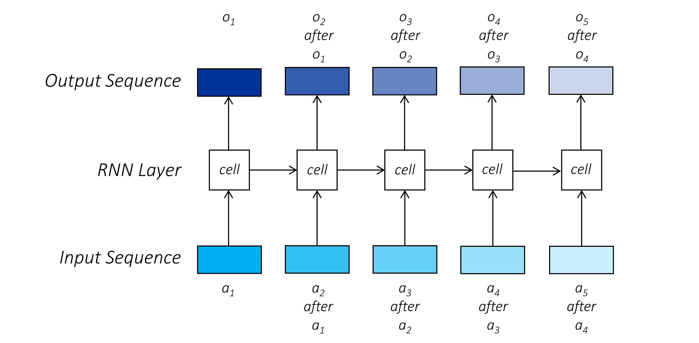
</p>

On the other hand, our ability to train deep neural networks is somewhat predicated on our ability to perform efficient computation. **The sequential nature of RNNs precludes parallelization** – you cannot move to the next token in the sequence without processing the previous one. Training networks on large amounts of data can be significantly time consuming.

**Transformers can process elements in a sequence *in parallel*.**

<p align="center">
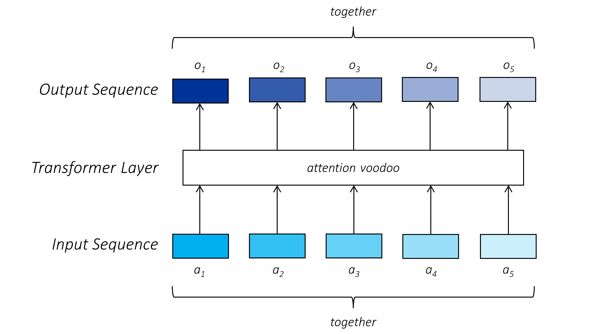
</p>

The sequential processing of text in an RNN introduces another problem. The output of the RNN at a given position is conditioned directly on the output at the previous position, which in turn is conditioned on *its* previous position, and so on. However, **logical dependencies in text can occur across longer distances**. It is often the case that you need access to information from a dozen positions ago. 

No doubt some of this information can persist across moderate distances, but a lot of it **could have decayed in the daisy-chain of computation that defines the RNN**. It's easy to see why – we're relying on the output at each position to encode not only the output at *that* position but also _other_ information that may (or may not) be useful ten steps down the line, with the outputs of each intervening step also having to encode their own information *and* pass on this possibly relevant information. 

There have been various modifications to the original RNN cell over the years to allievate this problem, the most notable of which is probably the Long Short-Term Memory (LSTM) cell, which introduces an additional pathway known as the "cell state" for the sequential flow of information across cells, thereby reducing the burden on the cell outputs to encode all of this information. While this allows for modeling longer dependencies, the fundamental problem still exists – **an RNN can access other positions only through intervening positions** and not directly. 

**Transformers allow *direct access* to other positions.**

<p align="center">
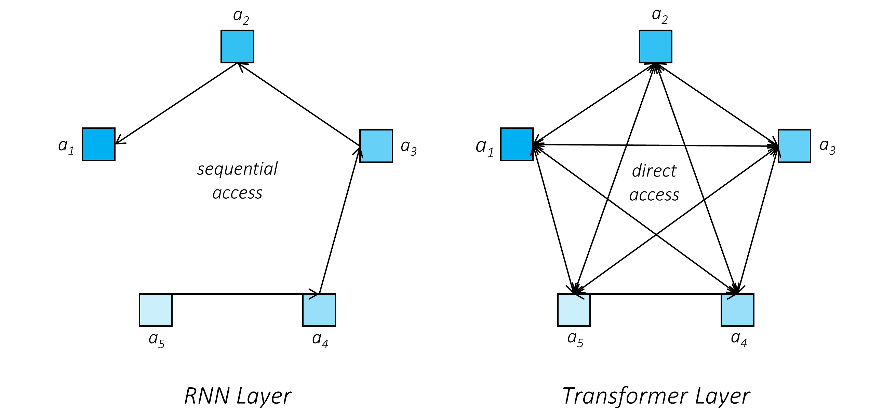
</p>

This means that each position can use information directly from other positions in a sequence, producing a highly context-aware and nuanced output. This, along with other design choices we will see later, makes way for **transformers' unprecedented representational ability**.

The "direct access" we are speaking of occurs through an **attention mechanism**, something not completely unlike attention mechanisms you may have encountered earlier – for example, between an RNN encoder and decoder. If the concept is completely unfamiliar to you, it doesn't matter as we will go over it in quite some detail very soon.

I would like to point out here that RNNs need not be unidirectional. Since important textual context can occur both before and after a certain position in the sequence, we often use *bidrectional* RNNs, where we operate two different RNN cells in opposite directions and combine their outputs. On the other hand, **a transformer layer is inherently bidirectional** – unless we choose to constrain access to a particular direction, as we will see later.

Also note that in RNNs, information about the positions of individual elements in the sequence are inherently encoded into the RNN by the fact that we process them in a specific order. If in a transformer, they are being processed all at once, **we need another way of introducing this positional information**. We will explore this later on.

Another thing to keep in mind is that, **during inference, the part of a trained transformer network that deals with the *generation* of a new sequence still operates autoregressively**, like in an RNN, where each element of the sequence is produced from previously generated elements. During training, *everything* is parallelized. Encoding a known sequence, such as the input sequence, is *always* parallelized.

### Wait. A sequence of what?

Words? Not necessarily. 

In fact, over the years, we've tried just about everything – characters, words, and... *sub*words. 

**Subwords** can be characters, words, or anything in between. They are a nice trade-off between a compact character vocabulary with units that aren't meaningful by themselves that produce extremely long sequences, and a monstrously large vocabulary of full words that would still be completely tripped up by a new word. Subwords allow for encoding almost any word, even unseen words, with a relatively compressed vocabulary size.

To create an optimal vocabulary of subwords, we will be using a technique called **Byte Pair Encoding**, a form of subword tokenization. We will study how this works [later](https://github.com/sgrvinod/a-PyTorch-Tutorial-to-Machine-Translation#byte-pair-encoding). For now, I only wanted to give you a heads up in case you're wondering why the sequences in our examples are not always split into full words. 

As an example, let's consider the following –

> The most beautiful thing we can experience is the mysterious. It is the fundamental emotion which stands at the cradle of true art and true science.

This is a quotation from Albert Einstein, *but only a translation* because he originally said it in his native German –

> Das Schönste, was wir erleben können, ist das Geheimnisvolle. Es ist das Grundgefühl, das an der Wiege von wahrer Kunst und Wissenschaft steht.

The model implemented in this tutorial back-translates this common English translation back to German, as –

> Das Schönste, was wir erleben können, ist das Geheimnis: Es ist die grundlegende Emotion die an der Wiege der wahren Kunst und der wahren Wissenschaft steht.

The model does a fairly good job, as far as I can tell. It opts for the noun *Geheimnis* (instead of the adjective *Geheimnisvolle*) which is primarily used to mean something akin to "secret" rather than "mystery", but the context is still clear. Also, it presents the output as a single sentence which is not surprising because it was trained predominantly on single sentences.

The English quote above is tokenized as follows –

```python
["_The", "_most", "_beautiful", "_thing", "_we", "_can", "_experience", "_is", "_the", "_myster", "ious", ".", "_It", "_is", "_the", "_fundamental", "_emotion", "_which", "_stands", "_at", "_the", "_c", "rad", "le", "_of", "_true", "_art", "_and", "_true", "_science", "."]
```

The German translation by the model is tokenized as –

```python
["_Das", "_Schön", "ste,", "_was", "_wir", "_erleben", "_können,", "_ist", "_das", "_Geheim", "nis", ":", "_Es", "_ist", "_die", "_grundlegende", "_Em", "otion", "_die", "_an", "_der", "_Wie", "ge", "_der", "_wahren", "_Kunst", "_und", "_der", "_wahren", "_Wissenschaft", "_steht."]
```

**We will use this English-German input-output pair as an example frequently through this tutorial**, although there may be other examples as well.

You can see in the tokenization that common words are retained as full words, but others are split into multiple parts. The "_" (underscore) character signifies the beginning of a word in the original sentence.

From this point on, I will simply refer to the units in a sequence as ***tokens***.

### A familiar form

While a transformer is quite different in its inner working compared to an RNN, they do take on a structure that you may already be familiar with – **an encoder and a decoder.**

The goal of the encoder is to ***encode* the input sequence** into a deep, "learned" representation. Like in an RNN, this involves encoding each token in the sequence.

<p align="center">

</p>

The goal of the decoder is to use this encoded representation of the input sequence to **produce the output sequence.** Like in an RNN, during training, we use something called ***teacher forcing*** – we use every word from the true output sequence to learn to generate the next true word in the sequence. But while an RNN still processes the input sequence and generates sequentially, a transformer does it in parallel.

<p align="center">
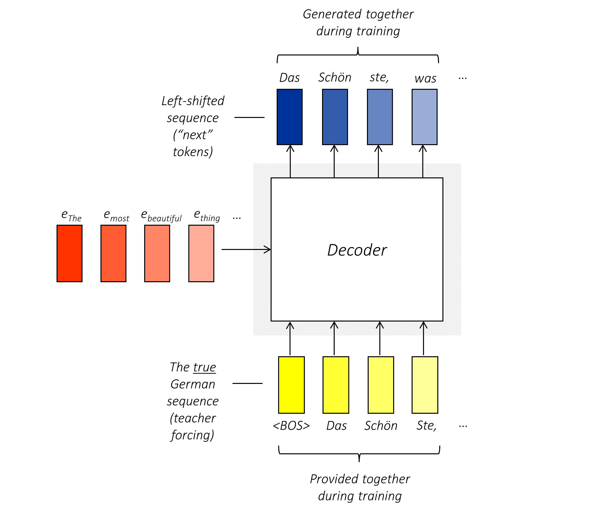
</p>

During inference, the decoder operates autoregressively, which means that it generates one word at a time, each of which is used to generate the next word. 

The first generation is prompted with a `<BOS>` token, which implies "beginning of sequence – start generating".

<p align="center">
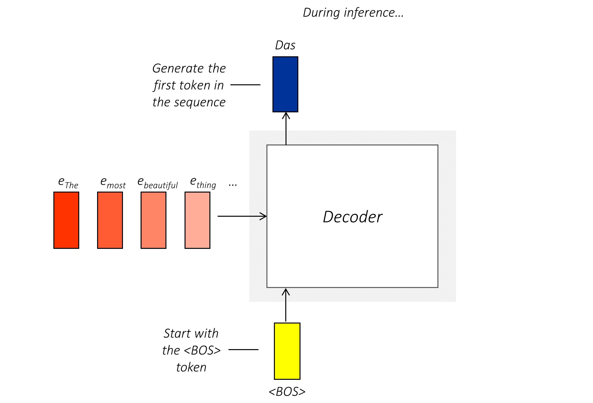
</p>

In the next step, the second token is generated from the first generation.

<p align="center">
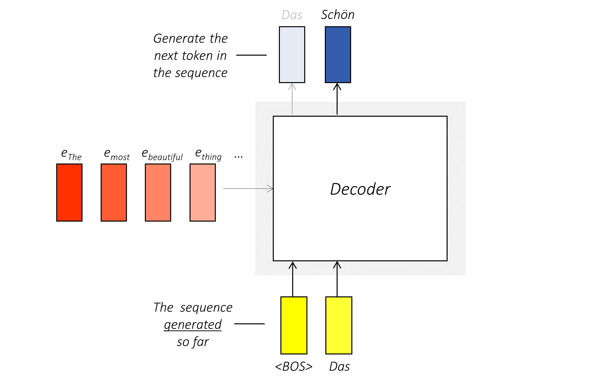
</p>

And then, another.

<p align="center">
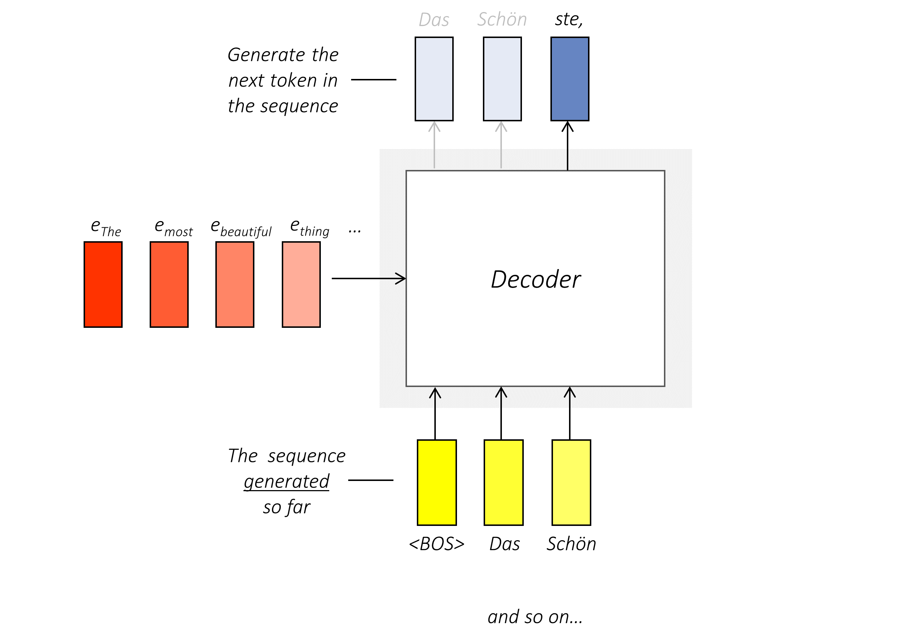
</p>

You get the drift. The generative process is terminated upon the generation of an `<EOS>` token which signifies "end of sequence – I'm done".

Depending on the task at hand, **you need either only the encoder, only the decoder, or both** –

- A sequence classification or labeling task requires only the encoder. Popular transformer models like **BERT** are encoder-only. 

- A sequence-to-sequence task (such as machine translation in this tutorial) *conventionally* uses both the encoder and decoder in the set-up we just described. Popular transformer models like **T5** and **BART** are encoder-decoder formulations.

- Sequence generation can also be accomplished by a decoder-only model, where the input sequence or prompt can be used as the first bunch of tokens in an autoregressive decoder. The popular **GPT** family of transformer models are decoder-only.

In fact, after this tutorial, it will be easy for you to read and understand the research papers for these and other popular transformer models because they adopt, for the most part, the same transformer architecture with some modifications.

Now, without further delay, let's dive into what makes a transformer... a transformer.

### Queries, Keys, and Values

Consider a *search* problem. 

<p align="center">
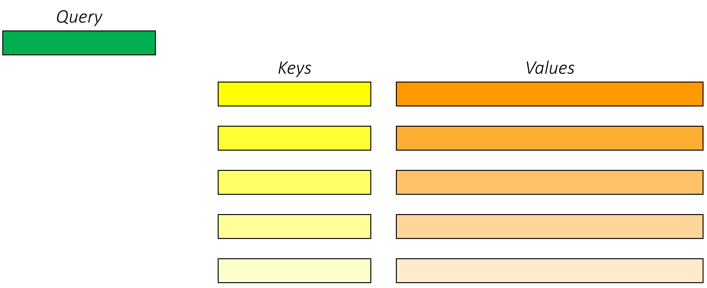
</p>

The goal is, given a ***query***, to find a ***value*** that is most closely matched to it. This will be accomplished by comparing the query to a ***key*** associated with each candidate value. 

<p align="center">
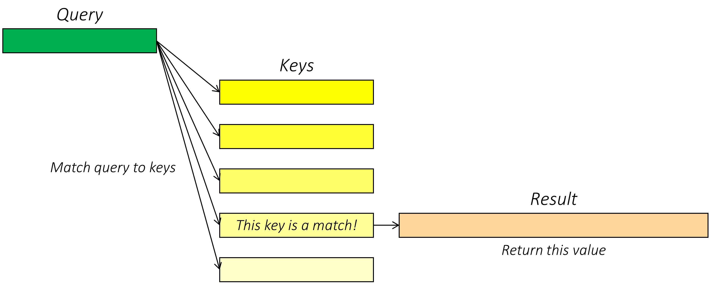
</p>

But in real life, there is rarely a single relevant match – relevancy is a spectrum! 

<p align="center">
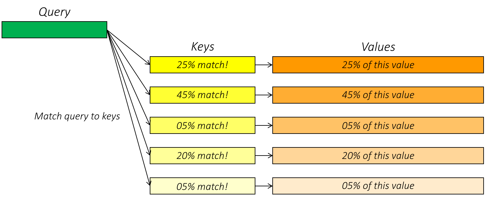
</p>

Would it then make sense to return a weighted average of the values instead as the result?

<p align="center">
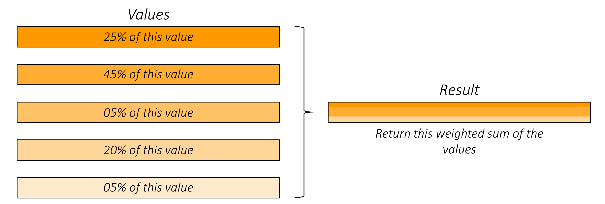
</p>

Yes, it would absolutely make sense, especially if the values are vectors or *embeddings*, where the different dimensions numerically encode various (and often abstract) properties!

**This process, in a nutshell, is the *attention* mechanism.**  The query is *attending* to the values via their keys. In other words, they query pays varying (but appropriate) degrees of *attention* to the different values, producing an aggregate, nuanced result that best represents that query in the context of these values. 

The terms *queries*, *keys*, and *values* were unfamiliar to me when I first read this paper. I suppose they're borrowed from database terminology. While not complex, they may be new to you as well and may take some time getting used to. At this point, remember only this – with an attention mechanism, **you can represent any token in your sequence, i.e. *query*, as some appropriately weighted sum of representations of all tokens, i.e. *values*, in the same or entirely different sequence**. 

Attention mechanisms are used commonly with RNNs, especially between an RNN encoder and decoder. [In one of my earlier tutorials](https://github.com/sgrvinod/a-PyTorch-Tutorial-to-Image-Captioning#attention), we used an attention mechanism in conjunction with an RNN decoder, where at each decoding step (query), we paid more attention to parts of the image (values) that are relevant at that decoding step and less attention to parts (values) that aren't relevant. 

In transformers, however, attention mechanisms not only abound – they are the driving force. Transformers are chockablock with attention mechanisms. I repeat, they're stuffed to the gills with attention mechanisms. Because, as the title of the paper declares, **attention is all you need!** 

Okay, now that I've hyped it up, you might be wondering exactly how the attention mechanism works. How is a query matched to the keys that represent the values? There are several different ways this can be accomplished. 

In the transformer, we use ***multi-head scaled dot-product attention***. Let's unpack this [ominous-sounding name](https://www.google.com/search?tbm=isch&q=multi+head+scaled+monster), shall we?

### *Dot-Product* Attention

Consider two sequences.

<p align="center">
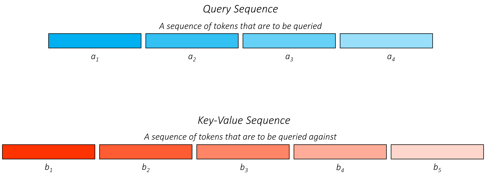
</p>

I have not used the English and German sequences from earlier as examples here, because the query sequence and key-value sequence can be *either*, as you will see later. For now, consider any general sequence $a$ or $b$.

The *query sequence* is composed of tokens that are to be queried against the tokens in the *key-value sequence*. That is, each token in the query sequence *attends* to each token in the *key-value sequence*. The goal, then, is to ultimately **represent each token in the query sequence in the form of a weighted sum of representations of the tokens in the key-value sequence**. 

Now, each token in the query sequence is to be queried, but is it already *a* query? Not yet. For example, the token could be represented as an embedding from a dictionary of token-embeddings. This may not be the optimal space for querying.

To generate the queries, **we project current token representations with a simple linear layer into a query-space.** This projection is part of the model and is learned.  

<p align="center">
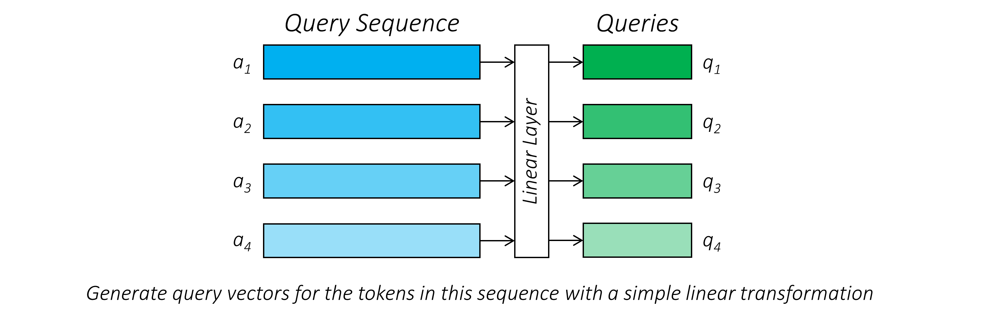
</p>

Similarly, tokens in the key-value sequence represent keys and values, but are not yet *the* keys and values. **We project these token-representations into keys and values with linear layers.**

<p align="center">
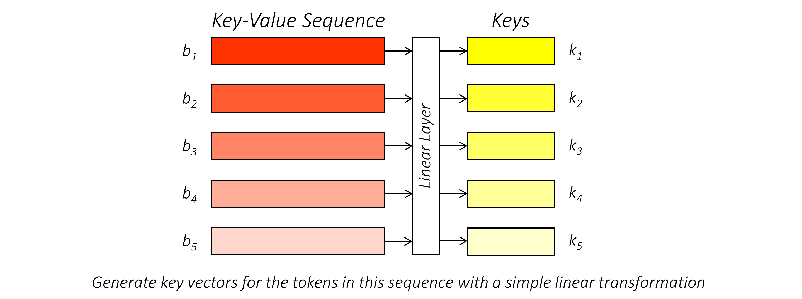
</p>

<p align="center">
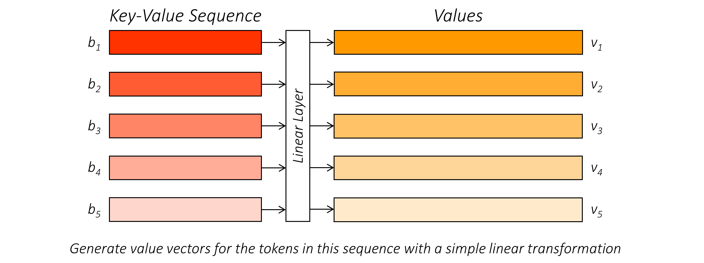
</p>

Naturally, these projections are learned during training. For the keys, the tokens should be projected into a space suitable for comparision with the queries. For the values, the tokens should be projected into a space that suitably represents the essence of these tokens because they will be used in a weighted average to represent each query.

After the queries, keys, and values (each a one-dimensional vector) are created, we move on to **quantifying the *match* between the queries and the keys**. 

As you may have surmised already, **this can be done with a dot-product**.

<p align="center">
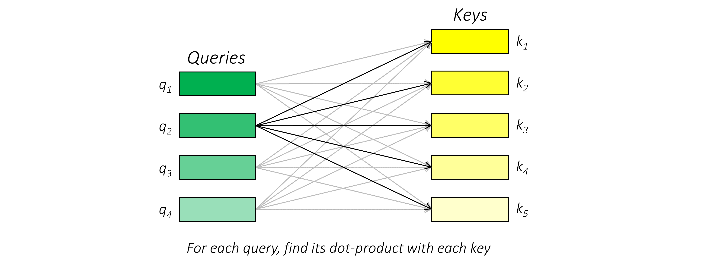
</p>

**Hence the name – *dot-product attention*.** There are other ways to do it too. For example, you could concatenate queries and keys (or representations thereof) and feed them through one or more linear layers that ultimately produce a scalar (single-valued) similarity score. This is known as *additive attention*, originally from [this paper](https://arxiv.org/abs/1409.0473) which – as far as I'm aware – was the first application of attention in a modern neural network. 

The **dot-products are then passed through a softmax layer** to convert them to percentages.

<p align="center">

</p>

We can now precisely describe how the attention of each token in the query sequence is divided between the tokens in the key-value sequence. That is, we are able to say something along the lines of "*token X in the query sequence attends 50% to token A, 10% to token B, and 40% to token C in the key-value sequence*".

The result for each query can thus be calculated as a **weighted average of the values in these same proportions.**

<p align="center">
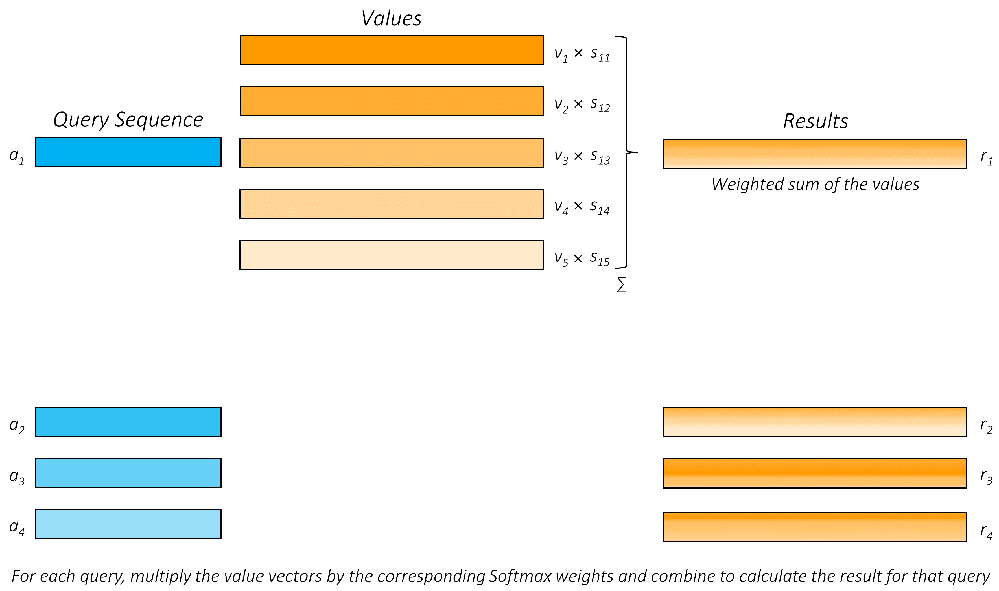
</p>

And voilà – through the attention mechanism, **we have now *reimagined* and *reinterpreted* each token in the query sequence in the appropriate context of the key-value sequence**. 

The easiest way to understand the value in doing this is to consider what we call ***self-attention***, where the query and key-value sequence are the same! This means that the tokens in a sequence attend to all the tokens *in the same sequence*. For example, in machine translation from English to German, each English token is originally represented by itself – an embedding that represents that token alone, with no situational awareness. Through the attention mechanism, we are able to *reimagine* and *reinterpret* each English token in the context of the entire English sentence! The token will now be represented in a richer, more *nuanced* form that provides a better understanding of the token for the purposes of translation.

On the other hand, you could also consider ***cross-attention***, where the query and key-value sequence are two different sequences – for instance, the German and English sequences, respectively. As we translate to German, we can query translated German tokens with respect to highly nuanced representations of the English sequence (produced by self-attention), enriching them with the knowledge required to further the translation. In fact, as you will see, we will do exactly this.

Finally, you could reproject the result from the attention mechanism into some other, more optimal space with your desired dimensionality. 

<p align="center">
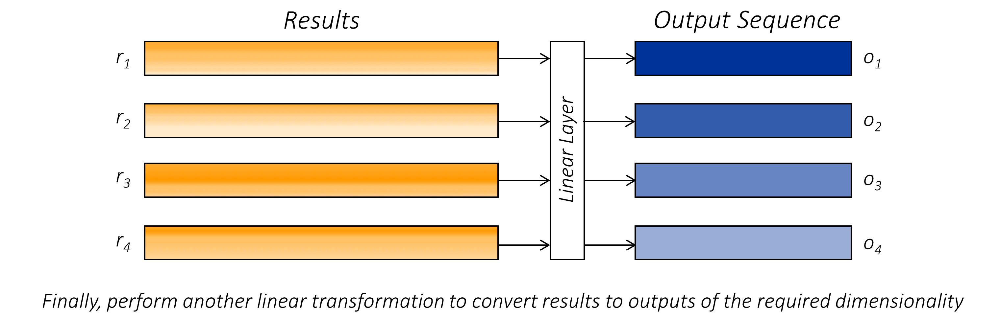
</p>

It's easy to see that the attention mechanism operates upon tokens ***in parallel***, unlike whatever happens in an RNN, because the attention of a particular token in the query sequence *does not* depend upon the attention of any other token in that sequence – they are independent of each other!

### *Scaled* Dot-Product Attention

The dot-product of two vectors is *unnormalized*. If the two vectors – queries and keys – are very highly dimensional, **the magnitude of the dot-product could potentially be quite large**, since we're summing as many terms as there are dimensions to compute the dot-product. 

This, in turn, would push the subsequent softmax operation to regions where the gradients during back-propagation would be very small, **limiting the ability of the network to learn.**

The authors of the paper therefore elect to normalize the dot-product with the number of dimensions in the two vectors – specifically, with $\sqrt{d_{queries}}$ (or $\sqrt{d_{keys}}$ because obviously $d_{queries}=d_{keys}$). 

<p align="center">
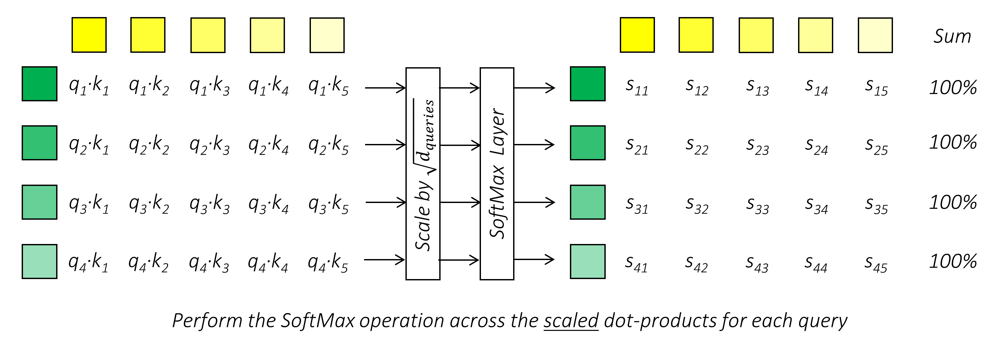
</p>

### *Multi-Head* Scaled Dot-Product Attention

The entire attention mechanism we just described is ***single-head attention***. The query sequence is attending to the key-value sequence just *once* – **producing *one* interpretation of each query**.

<p align="center">
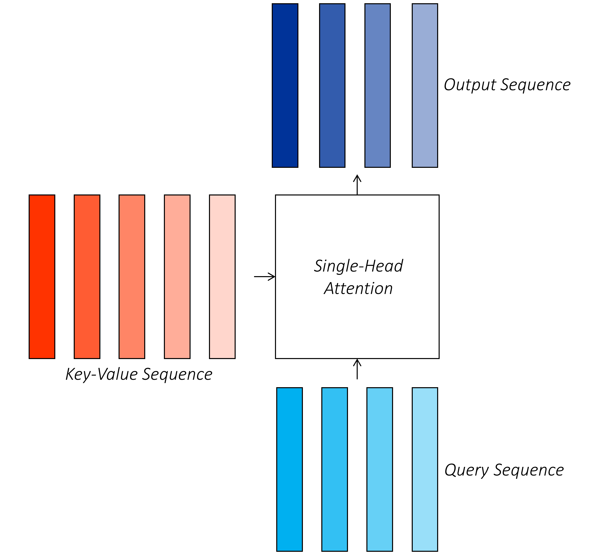
</p>

But if you think about it, **languages are rich and complex**. If we asked ten different people to describe the relationships between the tokens in a sentence, they'd probably all answer differently – and they might *all* be right. 

This is because **there are often *multiple* valid interpretations of the context for a query.** For instance, one person may relate nouns predominantly to the adjectives that describe them, and another might relate nouns more strongly to other nouns constituting subject-object relationships. And in the smorgasbord of abstractions that we call a neural network, you can expect a penchant for a huge variety of different interpretations that are each profoundly or obscurely useful to the task at hand.

How would this work? **Instead of producing a single set of queries, keys and values, we produce $h$ sets!**

For example, we'd use $h$ linear transformations to create $h$ query-sets from the query sequence. 

<p align="center">
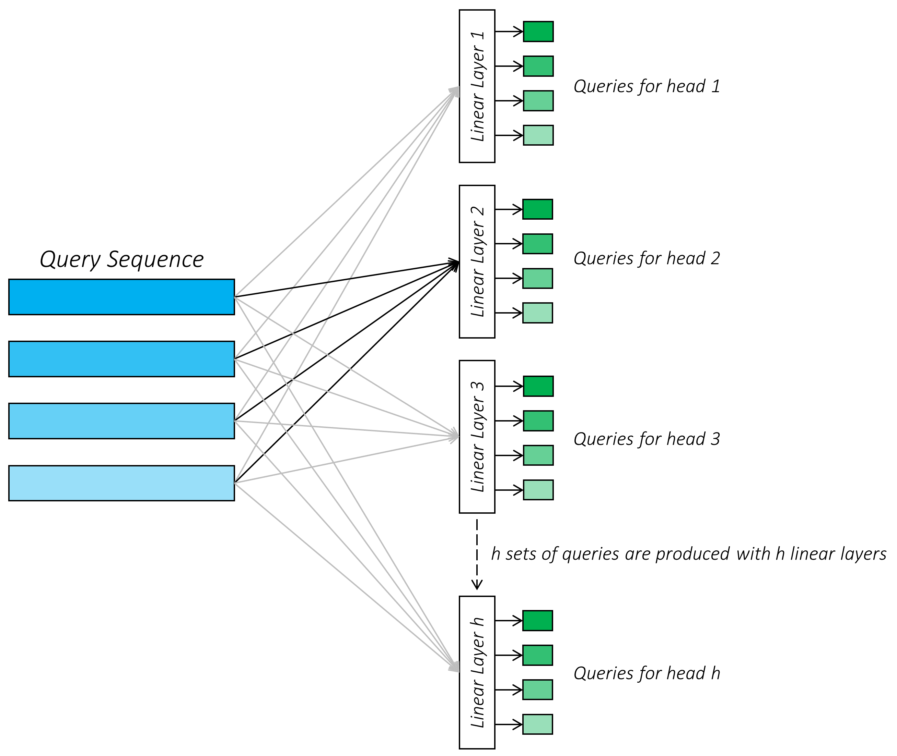
</p>

Similarly, we'd create $h$ sets of keys and values from the key-value sequence.

<p align="center">
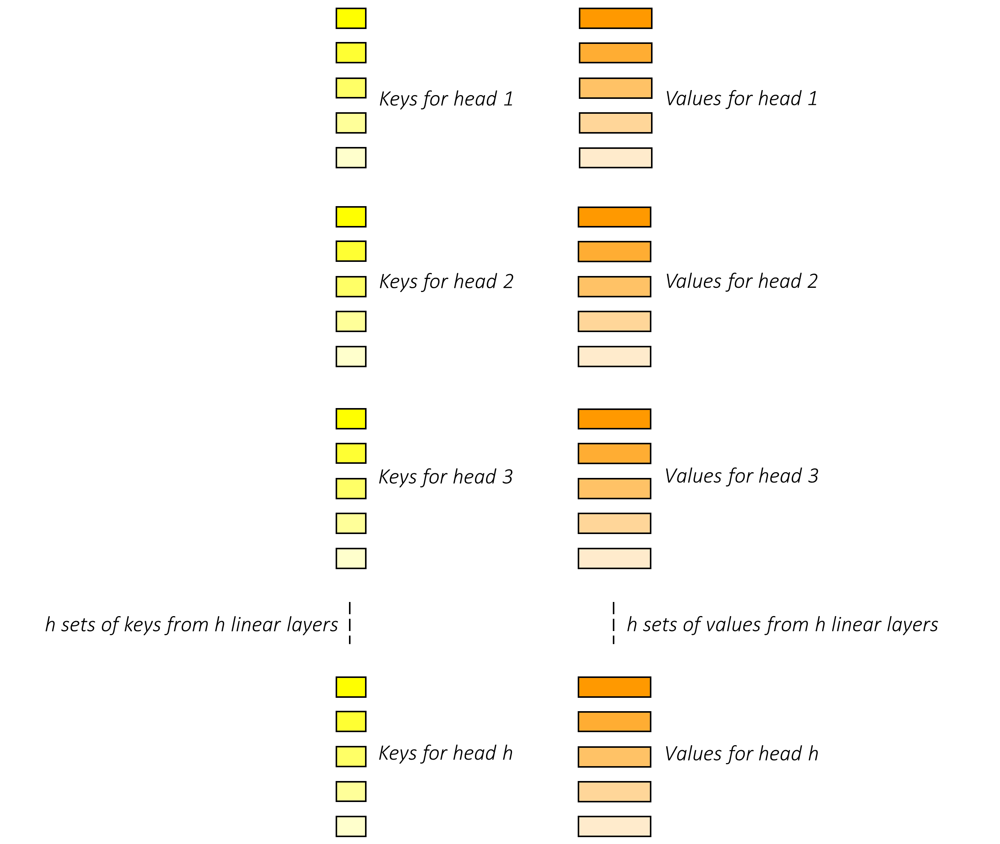
</p>

We perform the scaled dot-product attention operation (independently) for each set.

<p align="center">
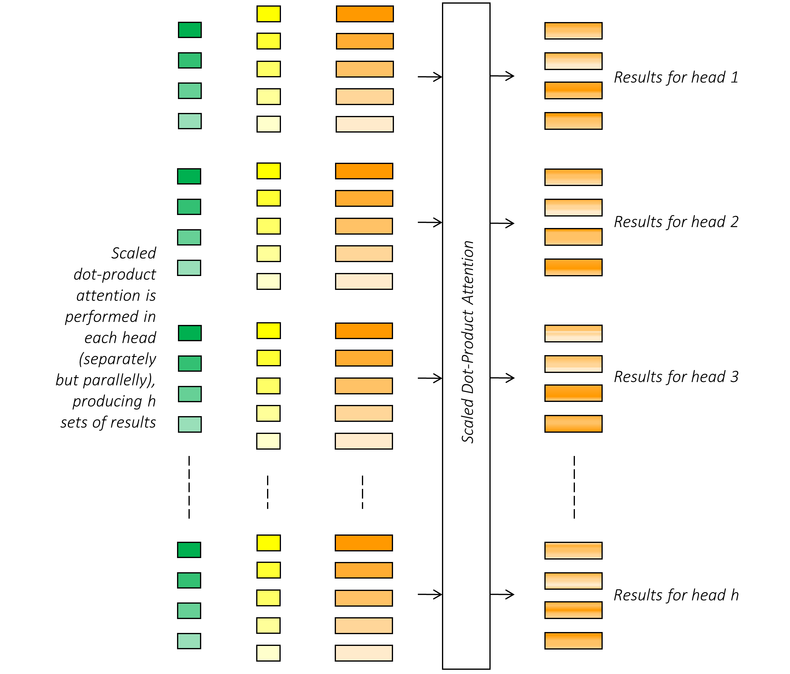
</p>

Finally, we produce a single representation for each query by concatenating the results from all attention heads and transforming to the required dimensionality. 

<p align="center">
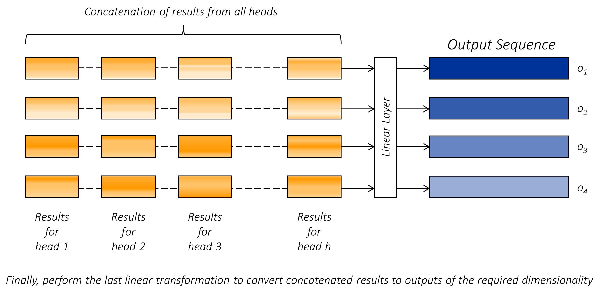
</p>

This is all quite wonderful – **but wouldn't it get terribly expensive to perform all this computation?** Yes – but no! 

If in single-head attention, we were using queries, keys, and values of dimensions $d_{queries}$, $d_{keys}$ ($=d_{queries}$), and $d_{values}$ respectively, we can maintain the same FLOPs in multi-head attention by using $h$ sets of queries, keys, and values of dimensions $\frac{d_{queries}}{h}$, $\frac{d_{keys}}{h}$, and $\frac{d_{values}}{h}$ respectively. **Using multiple heads with reduced dimensionality is still considerably better than using a single head.** 

<p align="center">                                                                       
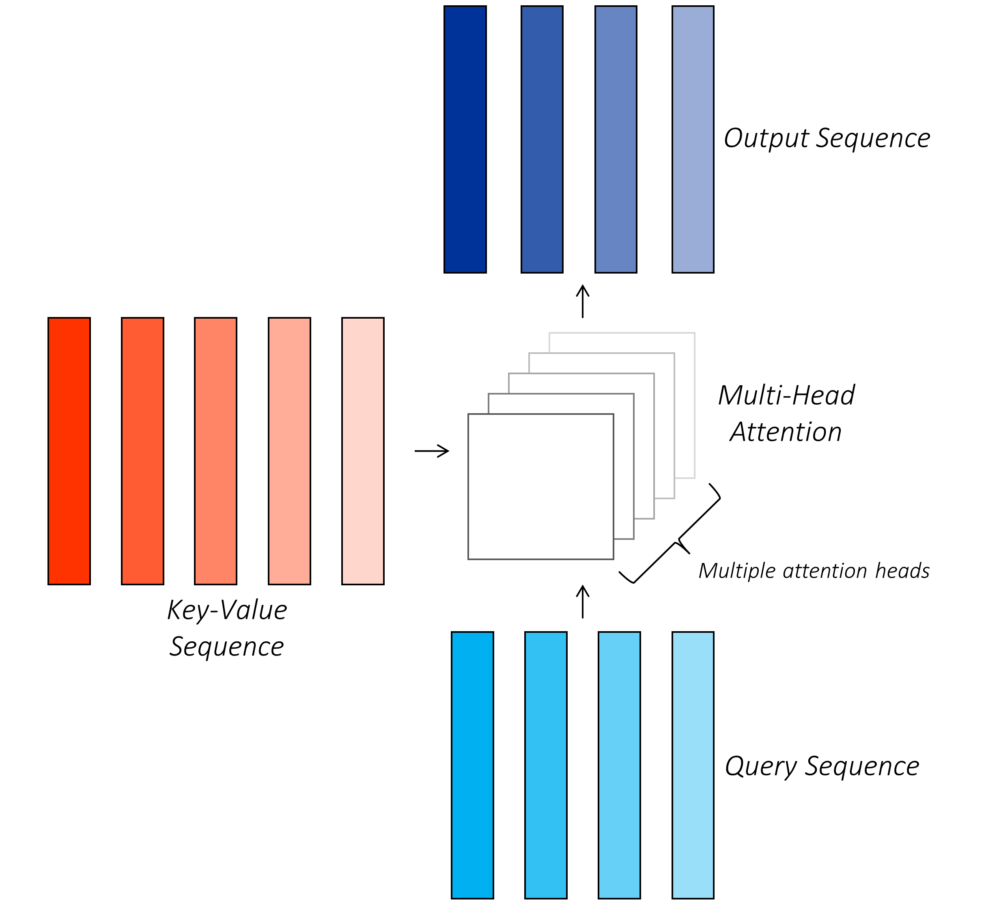
</p>

Since the heads are completely independent of each other, **they are easily parallelized.**

And there we have it – multi-head... scaled... dot-product... attention.

Don't worry if the concepts we've discussed so far seem hazy to you – it was for me too – because they *will* solidify in your mind soon. If anything, I find the attention mechanism in the transformer to be much more intuitive than the complex machinations of the LSTM cell. *Begone*, RNN!

### Dimensionality – a review

I'm aware that in the figures above, I've introduced a bajillion vectors with those pesky coloured rectangles. **What are their dimensionality?**

For convenience, the query and key-value sequences will have the same number of dimensions $d_{model}$. They need *not* be of the same size, but it's convenient.

<p align="center">                                                                       
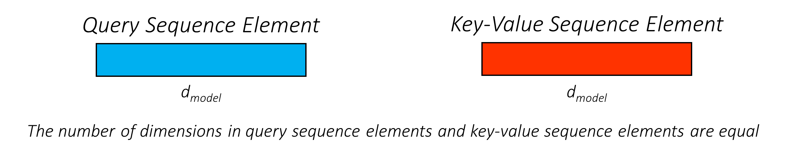
</p>

Queries and keys *must* be of the same dimensionality $d_{queries}$ because we will need to compute their dot-products.

<p align="center">                                                                       

</p>

Values can be of any desired number of dimensions $d_{values}$. 

<p align="center">                                                                       
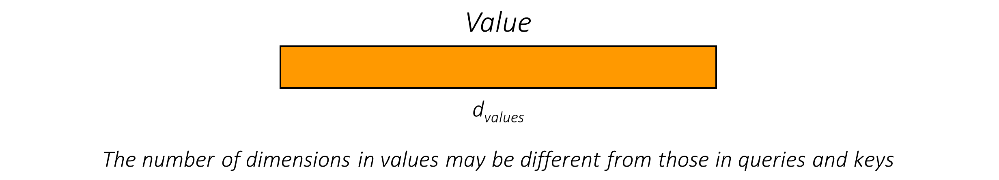
</p>

Naturally, the results for each query from the attention mechanism will also be of the same dimensions because they are weighted sums of values.

<p align="center">                                                                       

</p>

The final output can be of any dimensionality. But for convenience, and for enabling residual connections across the attention mechanism, we will use the same number of dimensions as in the input sequences $d_{model}$.

<p align="center">                                                       
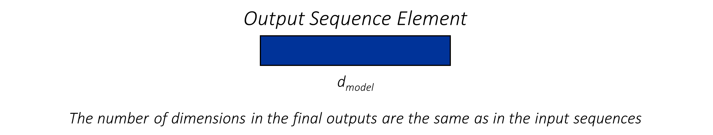
</p>

In fact, as the name suggests, we will use $d_{model}$ dimensionality for inputs and outputs throughout the transformer model!

### Self-Attention or Cross-Attention *Layer*

The entire multi-head scaled dot-product attention mechanism can be **encapsulated and represented in the form of a neural network layer**, whose learnable parameters are the parameters of the linear layers that produce the queries, keys, values, and the final outputs from the attention-weighted results.

To reiterate, in ***self*-attention**, the tokens in a sequence attend to all the tokens *in the same sequence*. Tokens that are originally represented by embeddings that represent that token alone, with no situational awareness, can be transformed into representations that provides nuanced interpretations of these tokens in the context of the sequence they are a part of. Stacking such self-attention layers builds upon these contexts, progressively reinterpreting and reimagining their meaning in the light of previous learnings. This is something that would benefit *both* sequences in a sequence-to-sequence setting – the English and German sequences, in this tutorial.

In the rest of the tutorial, we will denote a self-attention layer with a single colour, indicating that the query and key-value sequences are the same.

<p align="center">                                                       
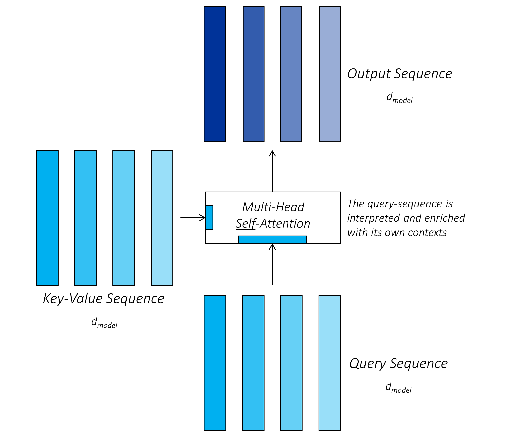
</p>

In ***cross*-attention**, we interpret a sequence in the light of a different sequence. As we saw [earlier](https://github.com/sgrvinod/a-PyTorch-Tutorial-to-Machine-Translation#a-familiar-form), generation of a new sequence during inference is piecemeal – tokens are generated one at a time. At each step, for example, a partially generated German sequence must be enriched with information from the English sequence, itself richly encoded through self-attention, required to further the translation. 

In the rest of the tutorial, we can denote a cross-attention layer with two different colours, indicating that the query and key-value sequences are *not* the same.

<p align="center">                                                       
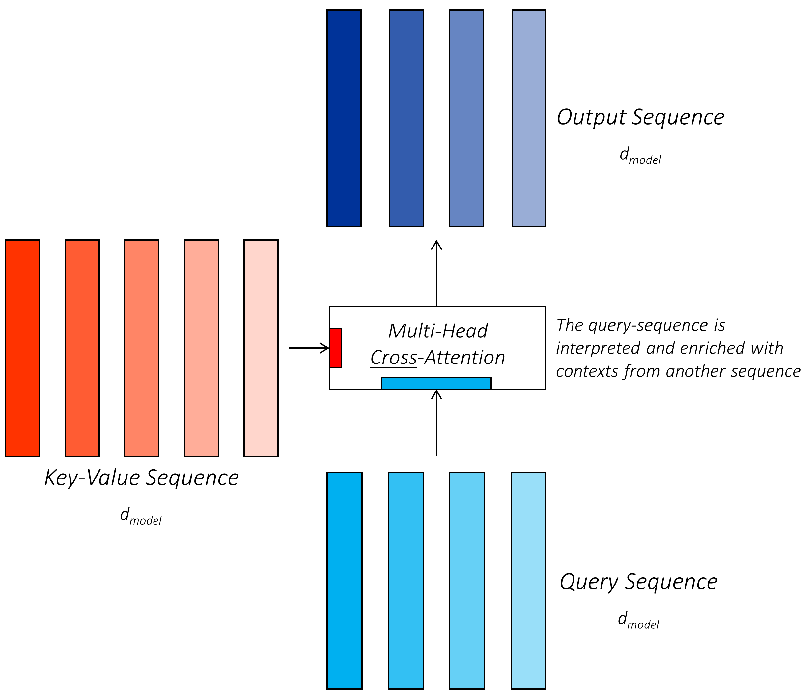
</p>

The inputs to and outputs of an attention layer are of size $d_{model}$.

### Feed-Forward Layer

Another component of a transformer network is a **two-layer feed-forward network with an intervening ReLU activation** that operates *position-wise*. This means that it operates on each token representation (i.e. position) independently and in the same way.

<p align="center">                            
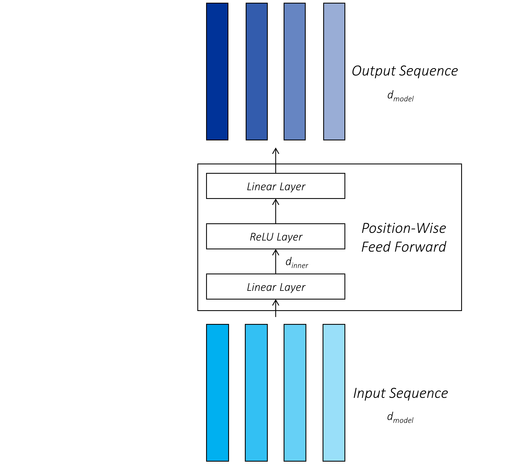
</p>

Like in the attention mechanism, the inputs to and outputs of this layer are also of size $d_{model}$. The first linear sublayer temporarily changes dimensionality to $d_{inner}$ before it is restored in the second linear sublayer.

### Transformer Encoder

Now that we have detailed the attention and feed-forward network layers, we can combine them in the specific configuration shown below to create the transformer encoder.

<p align="center">                            
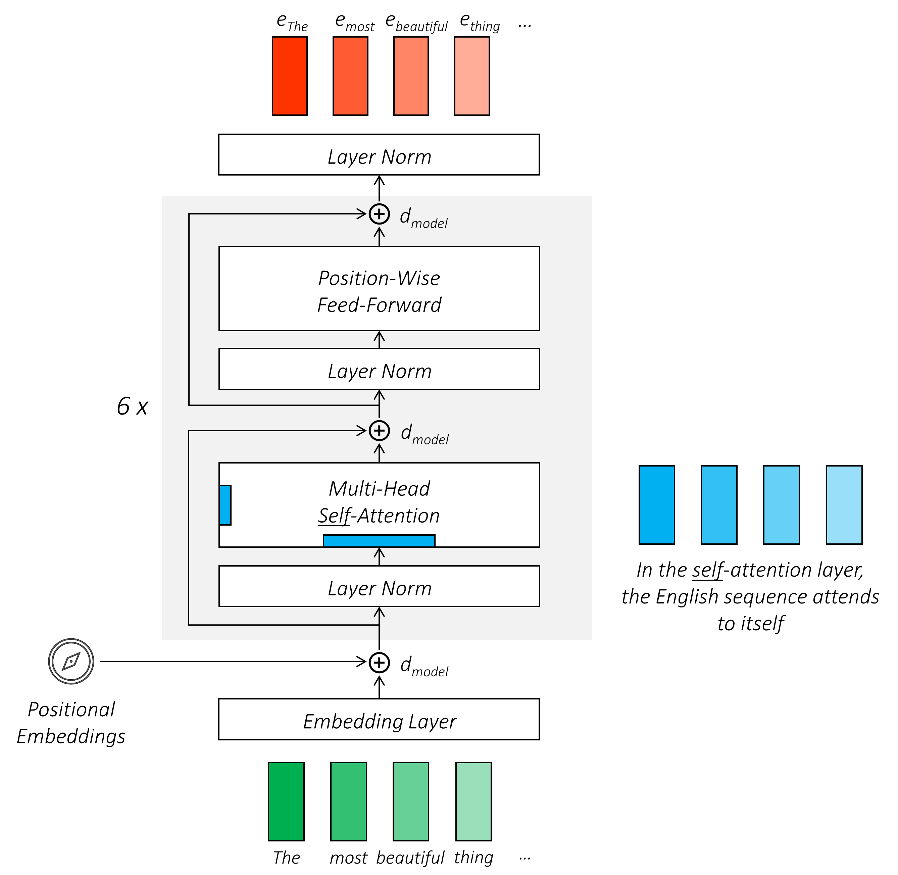
</p>

Notably –

- Tokens from the input (English) sequence is first embedded using a look-up embedding table. **Token embeddings** are learned during training. As you may know, this is pretty standard practice.

- We then add to each token embedding a ***positional* embedding**, which is a vector that signifies the position of the token in the sequence. As a transformer operates upon all tokens *together*, and not *sequentially* like in an RNN, we would need to explicitly indicate the positions of tokens. Positional embeddings are also stored in a look-up table. They can be learned, much like token embeddings, but the authors of the paper use a different strategy which we will examine very soon. 

- The transformer encoder consists of **$6$ encoder layers**. 
  
- Each encoder layer consists of a ***self*-attention sublayer** and a position-wise **feed-forward sublayer**. 
  
- In the self-attention sublayer, the tokens in the English sequence attend to themselves, producing rich, contextual token representations. As many as **$8$ attention heads** are used in each self-attention sublayer. The feed-forward sublayer provides additional refinement to representations from the attention sublayer. Note that attention or feedforward sublayers in different encoder layers are independent of each other – they *do not* share parameters.

- Each sublayer is preceded by **layer normalization**, which stabilizes the network and accelerates training. 
  
- **Residual connections** are applied across the each *layer-norm + sublayer* combination. Hence, and as discussed earlier, inputs and outputs to the sublayers must be of the same dimensionality $d_{model}$, which is also maintained across all encoder layers for convenience.

As you can imagine, as the English sequence propagates through the encoder layers, it is progressively transformed into richer and more context-aware representation, each subsequent self-attention layer with its many heads mixing and matching numerous contexts diligently – and contexts *upon* contexts *upon* contexts. 

Ultimately, it emerges as a *highly* nuanced encoding that serves as a great representation of the input sequence that can be fully understood and assessed for the purposes of translation by the decoder. 

### Transformer Decoder

The transformer decoder is similar in structure to the encoder. 

<p align="center">                            
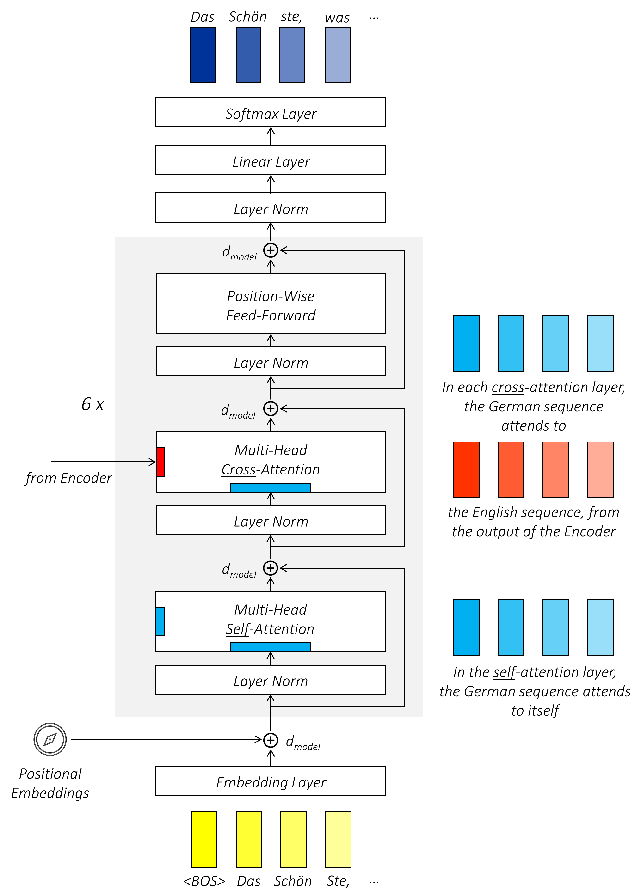
</p>

Notably –

- Tokens from the input (German) sequence are also first embedded using a learnable look-up embedding table – in fact, the *same* look-up table used in the encoder. The vocabulary is shared between English and German, and so are the **token embeddings**. Embeddings for tokens that are used in both English and German sequences will learn from *both* languages, which makes sense because languages can have similar roots.

- **Positional embeddings** are added. The same positional embedding look-up table is shared between the encoder and decoder.

- The transformer decoder consists of **$6$ decoder layers**. 
  
- Each decoder layer consists of a ***self*-attention sublayer**, a ***cross*-attention sublayer**, and a  position-wise **feed-forward sublayer**. 

- While the self-attention sublayer allows the input (German) sequence to attend to its own contexts, the cross-attention sublayer allows for attending to contexts in the encoded English sequence from the encoder, which is what must be translated! Both sublayers use **$8$ attention heads**.
  
- The outputs of the final decoder layer are linearly projected to the size of the vocabulary $v$ using a linear layer that functions as a **classification head** and the *Softmax* operation is applied to generate probability scores for next-word predictions.

- This classification head has learnable parameters of size $v \times d_{model}$. The shared English-German learnable embedding look-up table *also* has parameters of size $v \times d_{model}$. The parameters of the embedding table are *tied* to the parameters of the classification head. In other words, these parameters are shared. 

As the German sequence propagates through the decoder layers, representations at each German token position are enriched with the know-how required, both from the German tokens available thus far and the full, encoded English sequence, to generate the next token in the German sequence.

While [sharing weights](https://arxiv.org/abs/1611.01462v3) between the embedding layers and the classification head is intuitive because the latter *is* learning token embeddings of a sort, it results in a drastic reduction in the number of parameters in the transformer model. Remember, $v$ is usually a very large number!  Consequently, these parameters receive gradient information during back-propagation at *three* points in the network – at the classification head, at the beginning of the decoder where German token embeddings are looked up, and at the beginning of the encoder where English token embeddings are looked up. 

### Putting it all together

We are now in a position to visualize the transformer network in its entirety.

<p align="center">                            
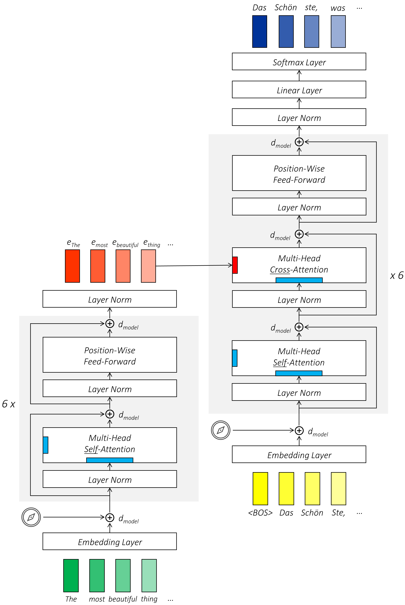
</p>

The authors of the paper use the following values in the transformer's construction –

- The input and output dimensions at each sublayer, and the embeddings, $d_{model} = 512$

- The number of layers in the encoder and decoder, $n_{layers} = 6$

- The number of heads in each attention sublayer, $h = 8$

- The dimensionality of queries in each head, $d_{queries} = 64$

- The dimensionality of keys in each head, $d_{keys} = d_{queries} = 64$

- The dimensionality of values in each head, $d_{values} = 64$

- The inner dimensionality of the position-wise feed-forward sublayer, $d_{inner} = 2048$

- Vocabulary size, $v = 37000$

### Can *anything* attend to *anything*?

Can all tokens in the query sequence *always* attend to all tokens in key-value sequence? No, not always. 

In addition, since we often deal with sequences of variable length which can only be fitted into tensors using *padding*, we must always be mindful of which tokens we are attending to.

In the **three flavours** of multi-head scaled dot-product attention we see in the transformer model, what might be the rules of attention-access?

#### Encoder Self-Attention

Here, the English sequence (in its current form) serves as both the query and key-value sequence. 

Since this sequence is already available in its entirety, **each token can attend to any token that is not a pad-token.**

<p align="center">                            
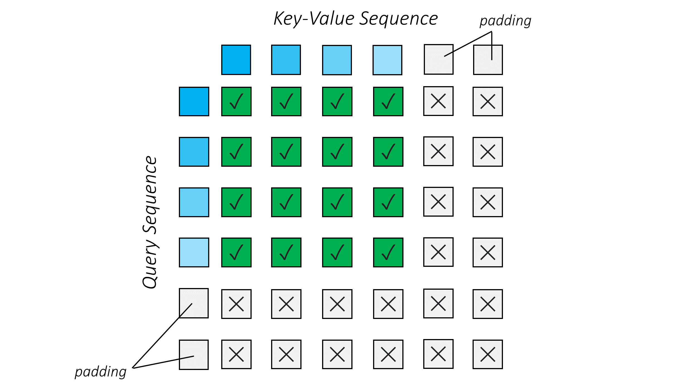
</p>

#### Decoder Self-Attention

Here, the German sequence (in its current form) serves as both the query and key-value sequence. 

At inference time, since generation of the German sequence is auto-regressive, each token only has access to the tokens *before* it. During training, even if generation is *not* auto-regressive due to the adoption of teacher forcing, the same conditions must be imposed. Therefore, **each token can attend only to prior tokens.**

<p align="center">                            
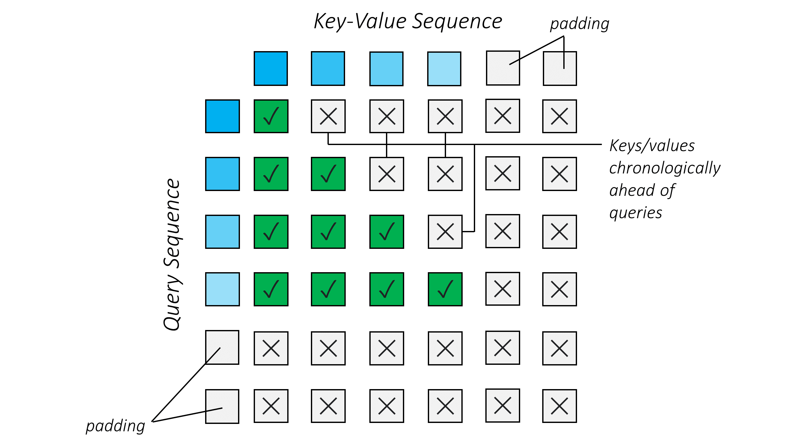
</p>

The attention pattern takes the form of the "lower triangle" of a matrix, including the diagonal. 

#### Decoder Cross-Attention

Here, the German sequence (in its current form) serves as the query sequence, and the English sequence (as output from the encoder) serves as the key-value sequence. 

Since the English sequence is already available in its entirety, **each German token can attend to any English token that is not a pad-token.**

<p align="center">                            
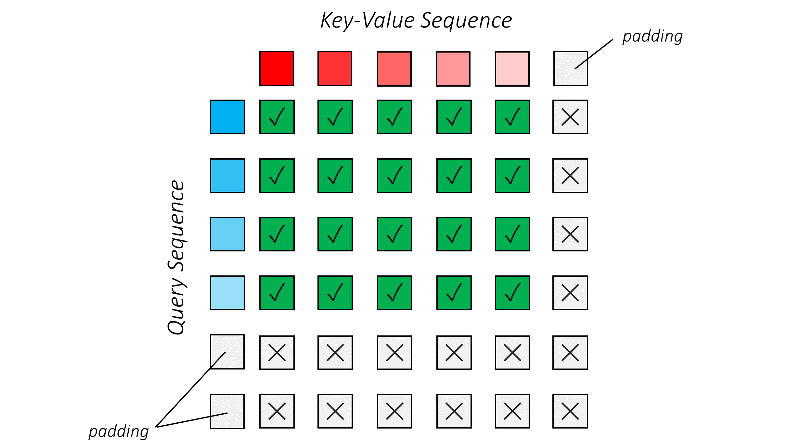
</p>

### Visualizing Attention – some examples

This might be a good time to take a look at actual examples of attention in different heads of multi-head attention mechanisms in our transformer model.

As we now know, **different attention heads** can learn to perform **different functions** or process the input sequence in **different contextual subspaces**. 

Interpreting *what* a certain head has learned and *why* it may be useful is not straightforward. After all, these models often work at a level of abstraction that is beyond us. But we can certainly *try*. In this section, we shall do so by taking a look at the attention weights produced in a head when provided with an English sequence to translate.

Consider the same English sequence from before –

> The most beautiful thing we can experience is the mysterious. It is the fundamental emotion which stands at the cradle of true art and true science.

The model trained in this tutorial translates to German as –

> Das Schönste, was wir erleben können, ist das Geheimnis: Es ist die grundlegende Emotion die an der Wiege der wahren Kunst und der wahren Wissenschaft steht.

The English sequence is tokenized as follows –

```python
['_The', '_most', '_beautiful', '_thing', '_we', '_can', '_experience', '_is', '_the', '_myster', 'ious', '.', '_It', '_is', '_the', '_fundamental', '_emotion', '_which', '_stands', '_at', '_the', '_c', 'rad', 'le', '_of', '_true', '_art', '_and', '_true', '_science', '.']
```

The German translation by the model is tokenized as follows –

```python
['_Das', '_Schön', 'ste,', '_was', '_wir', '_erleben', '_können,', '_ist', '_das', '_Geheim', 'nis', ':', '_Es', '_ist', '_die', '_grundlegende', '_Em', 'otion', '_die', '_an', '_der', '_Wie', 'ge', '_der', '_wahren', '_Kunst', '_und', '_der', '_wahren', '_Wissenschaft', '_steht.']
```

The figures below visualize a *few* heads from the first and last encoder and decoder layers. For visualizations of *all* heads in these layers, check the [*img* folder](https://github.com/sgrvinod/a-PyTorch-Tutorial-to-Machine-Translation/tree/master/img) in this repository. Note that I will omit the "_" (underscores) from the tokens, which represent word beginnings, for readability. 

#### Encoder Self-Attention

<p align="center">                            
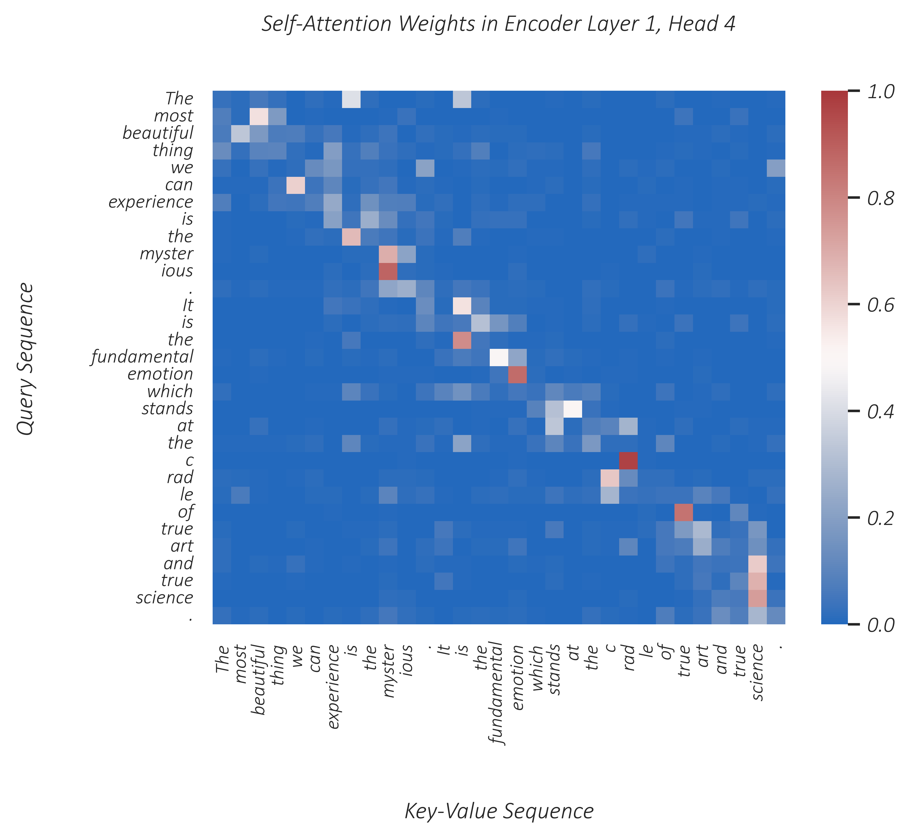
</p>

In this first example, in an attention head in the first encoder layer, we see a somewhat diagonal attention pattern, which might indicate that query tokens are being interpreted in the light of their immediate neighbourhoods. 

<p align="center">                            
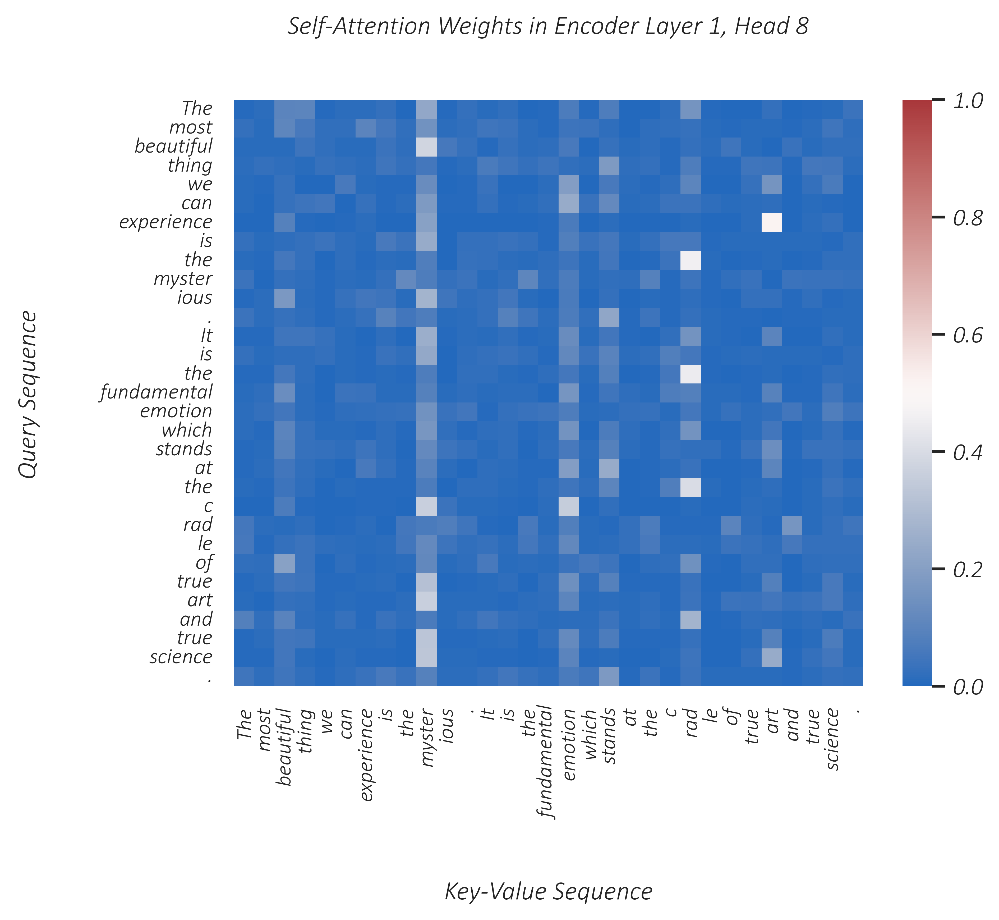
</p>

In a different head, everything in the sequence appears to be predominantly conditioned by a small number of presumably important tokens like "*beautiful*", "*myster*" (in "*mysterious*"), "*emotion*", "*rad*" (in "*cradle*"), as seen above. 

<p align="center">                            
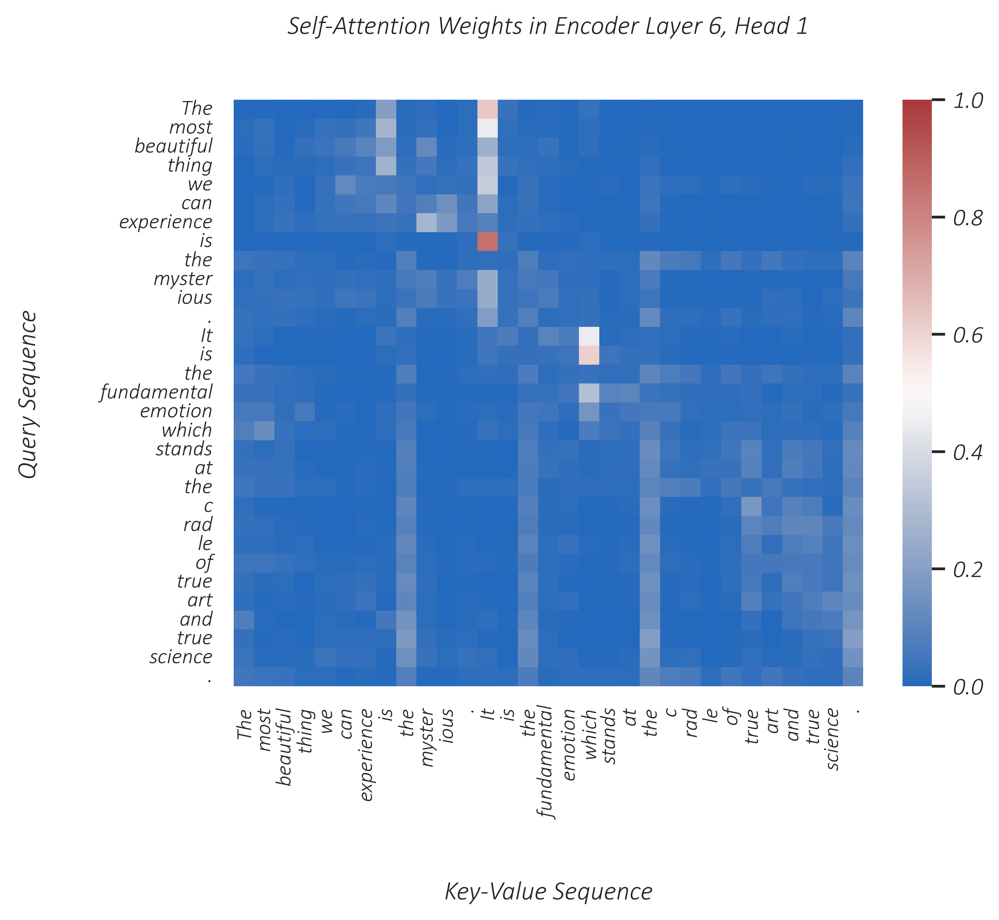
</p>

We see similar behaviour in a head in the last encoder layer, but this time attention is focused on stopword tokens (*stoptokens*?) like "*the*", "*it*", and ".". Remember, by the final layer, tokens are already quite context-rich – it could be that the model has chosen to encode specific information about the sequence into such tokens by this point.

<p align="center">                            
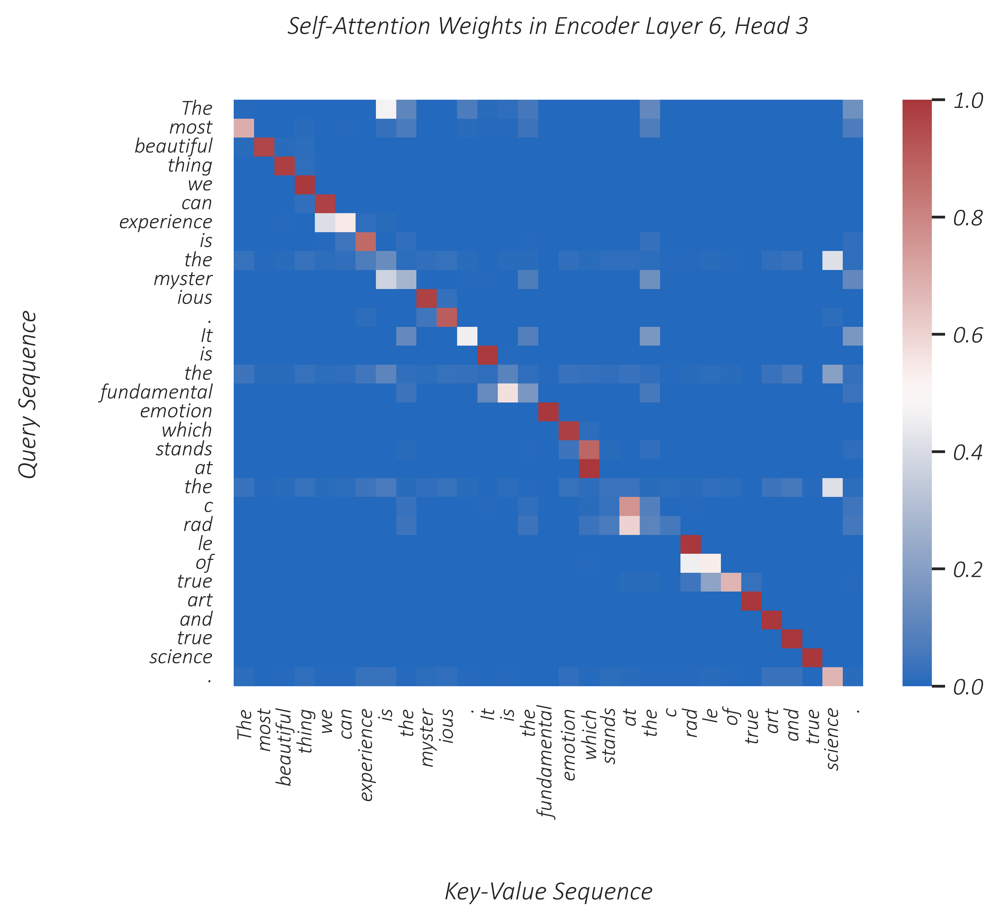
</p>

In the same layer, a different head presents the stark pattern shown above – each token is being conditioned by the token immediately before it. 

#### Decoder Self-Attention

<p align="center">                            
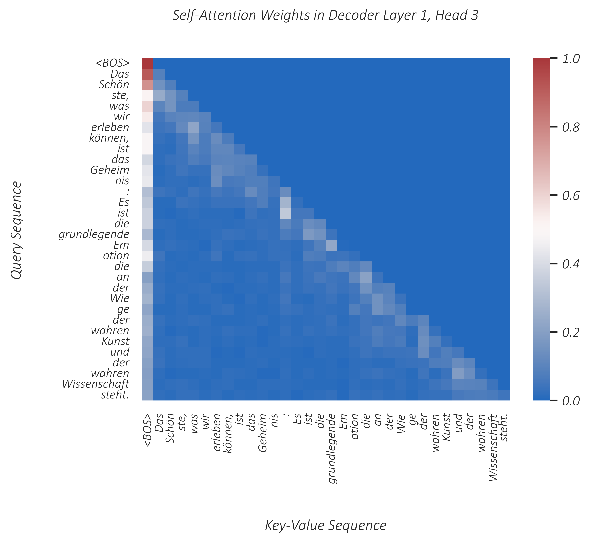
</p>

You can clearly see from this example that we have constrained self-attention in the decoder to prior tokens in the sequence.

The focus on the `<BOS>` token is certainly curious. 

<p align="center">                            
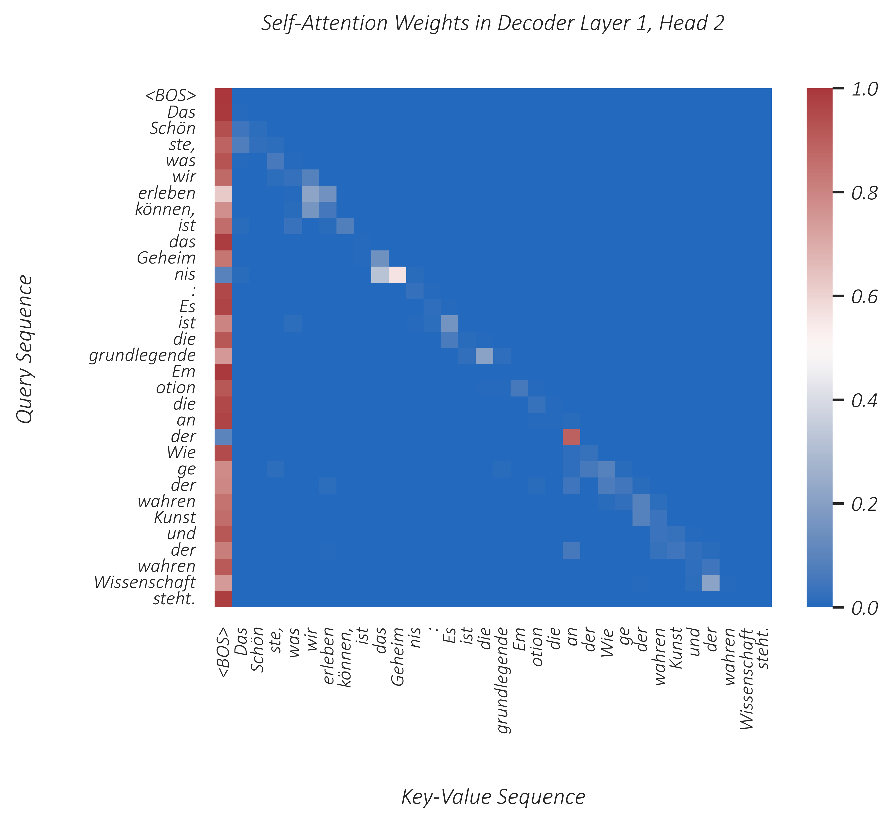
</p>

In the above head, this focus is much more severe, and I can't imagine how this is very useful in the first layer. Perhaps it works as a filter of sorts, where some tokens get to attend elsewhere, however minutely, and therefore stand out.

<p align="center">                            
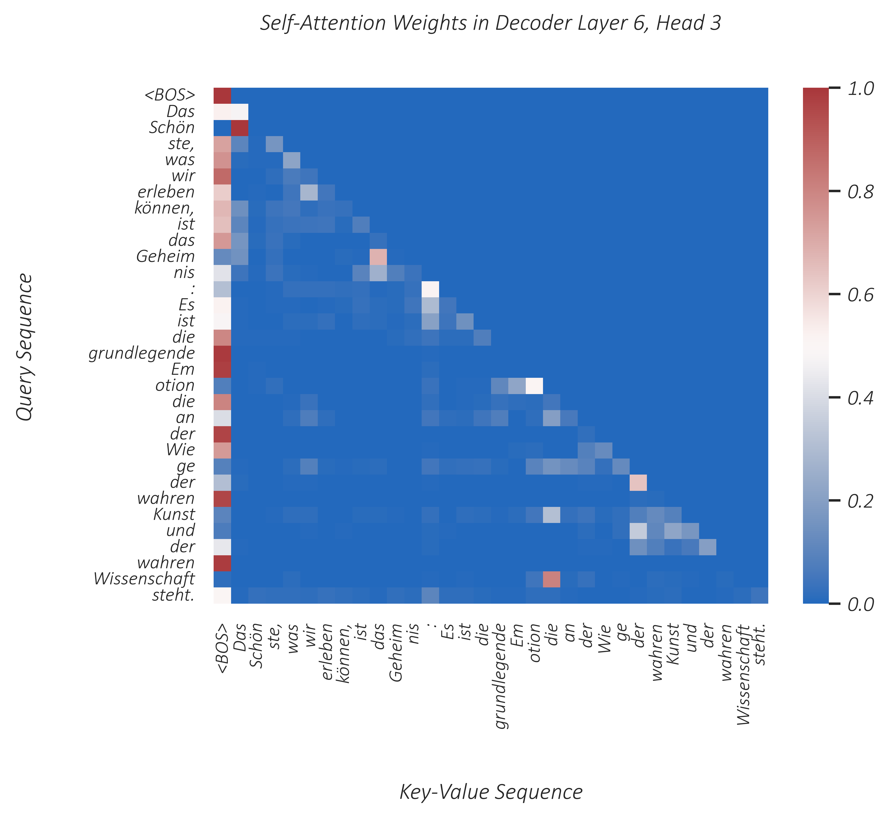
</p>

We see a similar pattern in some heads in the final layer, as seen above, but it can make a lot of sense here because, over the previous layers, the model can encode useful information about the sequence at the the `<BOS>` position. 

<p align="center">                            
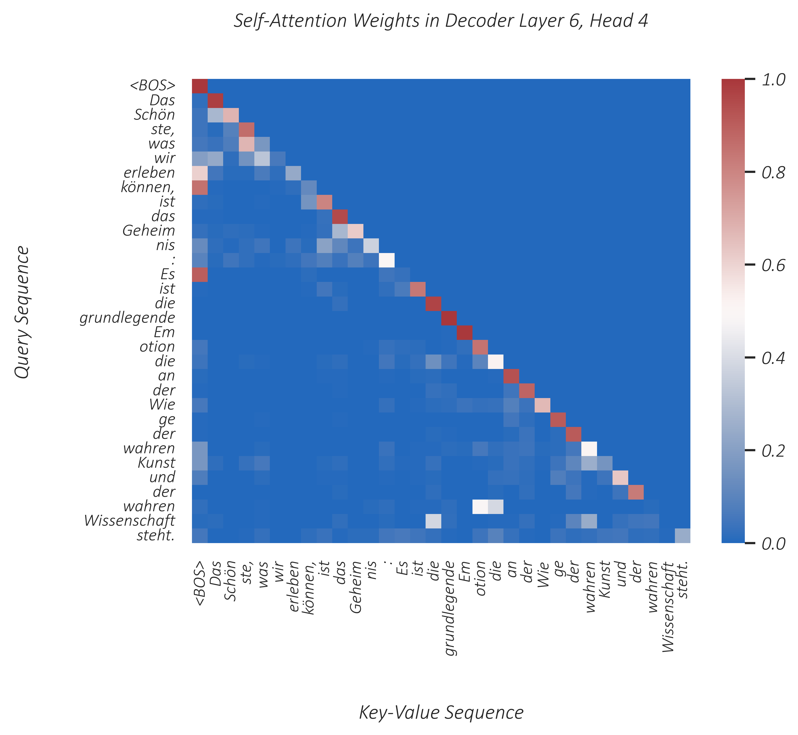
</p>

In the self-attention head above, we see a prominent diagonal, indicating that many tokens are attending significantly to themselves. 

#### Decoder Cross-Attention

In machine translation, cross-attention heads are of obvious interest, since this is where information is cross-pollinated from one language to another. 

<p align="center">                            
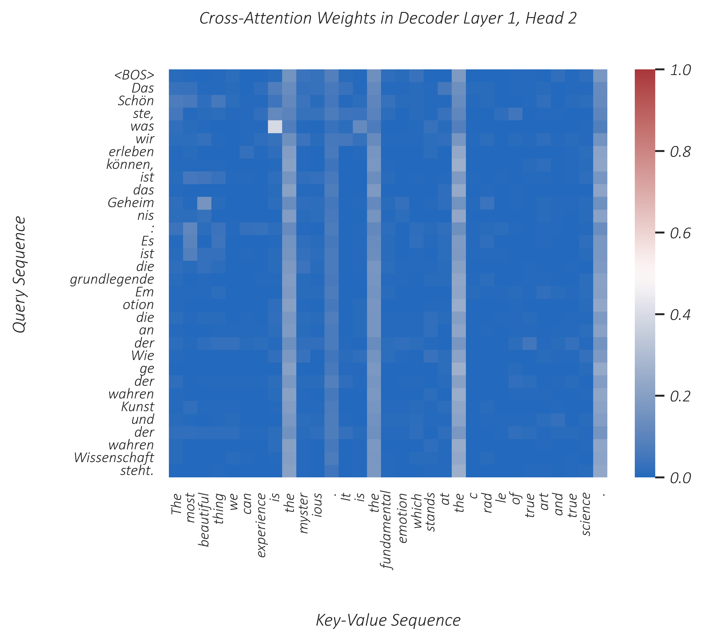
</p>

From the head above, we confirm our earlier suspicion that some non-keyword tokens are being used as carriers of some useful information about the English sequence.

<p align="center">                            
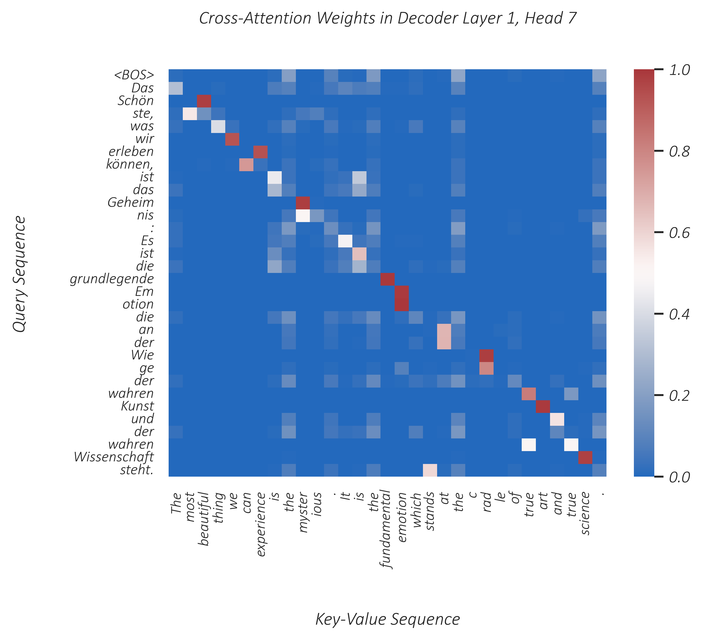
</p>

In this head, we catch a glimpse of the model's German-to-English dictionary, because German tokens are clearly attending to their English counterparts!

For visualizations of attention of *all* heads in the first or last encoder or decoder layers, check the [*img* folder](https://github.com/sgrvinod/a-PyTorch-Tutorial-to-Machine-Translation/tree/master/img) in this repository. But remember, it's often hard to understand why a particular head might be doing whatever it's doing. In most cases, we can only speculate, as I have above. And it's even harder in deeper layers because we've no idea what's been encoded into each position that far into the network.

Now, let's continue with our study of the transformer model – there are still a few loose ends to tie up.

### Positional Embeddings

RNNs *implicitly* account for the positions of tokens in a sequence by virtue of operating on these tokens sequentially. Transformers, however, are designed to be able to process tokens together – the ability to recognize their relative order is not baked into transformer layers.

We would therefore need to manually and *explicitly* provide positional information. As you saw earlier, this is done via **positional embeddings** – one-dimensional vectors representing the positions of tokens in the sequence. In other words, similar to how token embeddings each represent a token in the vocabulary, positional embeddings **each represent a position.** For example, the second token in a sequence will *always* be assigned the same positional embedding, regardless of what that token is. 

The positional embedding for each position is **added to the token embedding at that position**, with the resulting embedding representing both the meaning of the token and its place in the sequence. 

And like token embeddings, positional embeddings can be learned. You may assume, for instance, that you will never have more than 100 tokens in any given sequence and create a learnable look-up table for the 100 positions. If in an unusual situation you encounter an even longer sequence, you're out of luck – that 101st token and everything that comes after it *cannot* be supplied to the transformer. This isn't necessarily as dire as it sounds because truncating sequences at a length-limit can often be inconsequential depending upon the task at hand, as long as that limit is reasonable for the type of data you're working with.

Translation, however, is a task that's especially allergic to chopping the ends off sentences. In this particular paper, therefore, the authors choose a different route – **positional embeddings that can be precomputed mathematically up to any arbitrary sequence length**, with a recognizable pattern in them such that the transformer model would even be able to extrapolate to positions not seen during training. 

As humans, this is something we do as well. Nobody ever taught us to count up to, say, 10000000000 – and yet, *we can*. Given enough time, we can list the exact sequence of numbers that lead up to it. Because we *know* the pattern for how numbers change as they increase in numerical value. Natural or base-10 numbers have multiple dimensions that go from 0-9 in cycles, with each new "dimension" (digit to the left) taking ten times as long to complete a cycle. Binary numbers follow a similar pattern, but go from 0-1 and periods of cycles double from one dimension to another. 

<p align="center">                            
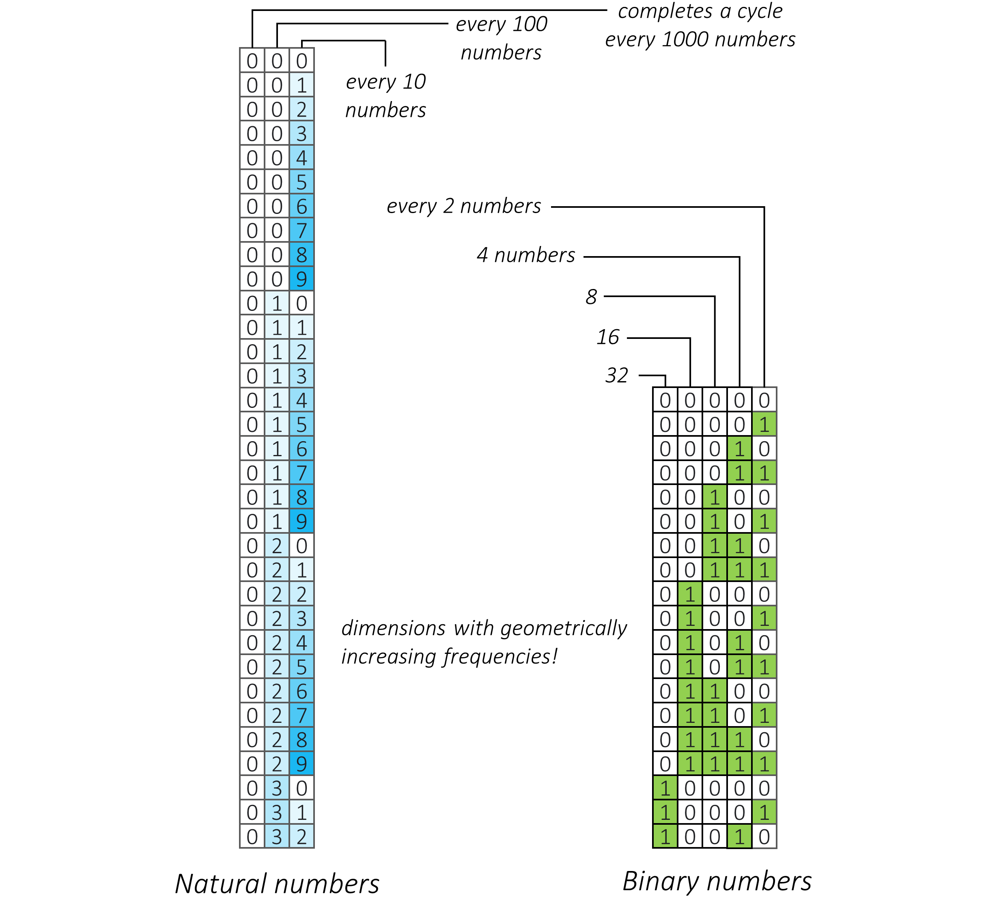
</p>

In fact, this is a common pattern (with some allowances) for how we count things! It's how we measure time on a clock, for example. The second, minute, and hour "hands" have decreasing frequencies or increasing periods. On an alien planet with longer days, for example, we may choose to have more mathematically pleasing clocks with 60-hour cycles, where each hour is composed of 60 minutes, and each minute composed of 60 seconds. 

Embeddings in a neural network, like all parameters or outputs, are floating-point numbers. Additionally, it is better for these numbers to be normalized to a fixed scale and centered in some way. How then would we define our positional embeddings such that the various dimensions encode cycles whose frequencies vary geometrically?

The authors use **sinusoids**. 

<p align="center">                            
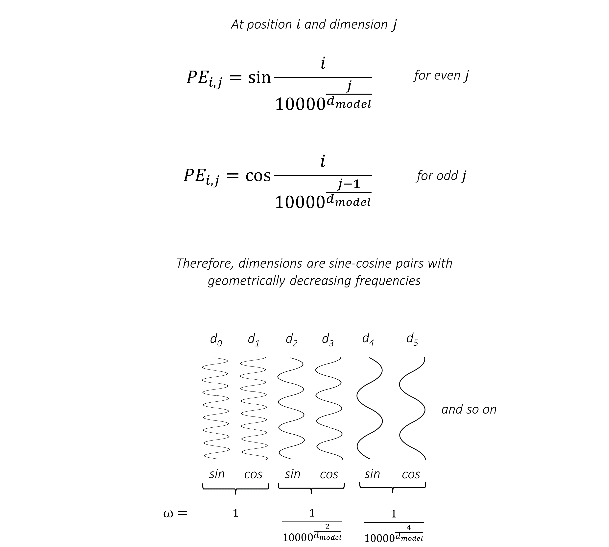
</p>

If you consider the standard sinusioidal forms $\sin\omega i$ and $\cos\omega i$, for positions $i$, you can see that the angular frequency $\omega$ decreases geometrically from $1$ to about $\frac{1}{10000}$ radians per position as you move from left to right in the embedding. This means that the frequency ($f=\frac{\omega}{2\pi}$) decreases from $\frac{1}{2\pi}$ to about $\frac{1}{10000\cdot2\pi}$ cycles per position, and the wavelength ($\lambda=\frac{1}{f}$) increases from $2\pi$ to about $10000\cdot2\pi$ positions per cycle. 

<p align="center">                            
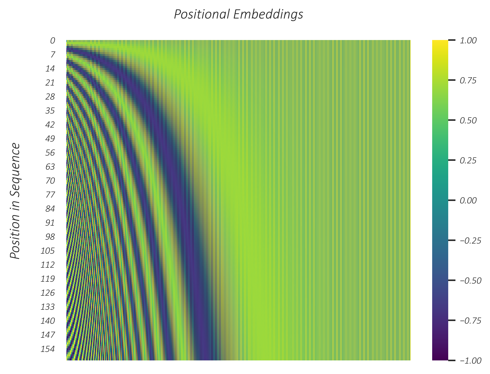
</p>

Importantly, **sinusoids' values at *any* position can be expressed as a linear function of their values $\phi$ positions away**, allowing the transformer to use information about the relative positions of tokens in the attention mechanism.

This means that for sinusoids of a given frequency $\omega$, their values at a position $i + \phi$ in the sequence, $\sin\omega (i+\phi)$ and $\cos\omega (i+\phi)$, can be expressed as a linear function of their values at the position $i$, $\sin\omega i$ and $\cos\omega i$. 

There's really no need to remember this, but if you're interested, this would be of the form $\sin\omega (i+\phi)=\cos\omega\phi\sin\omega i +\sin\omega\phi\cos\omega i$ and $\cos\omega (i+\phi)=\cos\omega\phi\cos\omega i -\sin\omega\phi\sin\omega i$.

As a matter of fact, positional embeddings in recent years have made the transition to directly encoding *relative* positions between tokens instead of their *absolute* positions. [Here's](https://jaketae.github.io/study/relative-positional-encoding/) a nice summary of such methods if you're interested in learning more. 

### Byte Pair Encoding (BPE)

We talked earlier about how we will discretize a sequence not *only* into words or characters, but a mixture of words, characters, *and* anything in between. This is known as ***subword* tokenization**.

A vocabulary with only single characters can encode any text with a very small vocabulary size. But sequences in their tokenized form can get impossibly long. And most characters, as learned and represented by their embeddings, are not as individually meaningful. 

A vocabulary with only words, each with inherent and specific meaning, would have to be *much* larger in order to encode an appreciable portion of any text corpus. Any rare, or new, or unseen word – even something as simple as the plural form of a known word – cannot be handled. And machine translation, like many other tasks, is a profoundly *open*-vocabulary problem. A limited vocabulary will result in a limited model, especially with languages that are [agglutinative](https://en.wikipedia.org/wiki/Agglutination) or [compounding](https://en.wikipedia.org/wiki/Compound_(linguistics)). 

**Byte Pair Encoding (BPE)** and other forms of subword tokenization offer a nice trade-off. They can **encode just about anything** with a moderately sized vocabulary and **tokens are still inherently meaningful**. Common words will usually be tokenized as words, and uncommon or unseen words can be tokenized as a sequence of linguistic building blocks such as [morphemes](https://en.wikipedia.org/wiki/Morpheme) or [root words](https://en.wikipedia.org/wiki/Root_(linguistics)) or, if needed, even single characters. This vocabulary is learned from the data.

Interestingly, BPE was originally designed as a data compression algorithm, where common byte sequences could be replaced with single bytes (whose expanded forms are stored in a dictionary), thus reducing the size of the data. But it is now commonly used for subword tokenization in NLP applications. 

The **algorithm is quite simple** (and fast) –

- Create a vocabulary of all single characters in the corpus. Treat characters at the beginnings of words as *separate* characters from the same characters occuring elsewhere in the word. For example, the letter "*a*" occuring at the beginning of a word can be represented as "*_a*", which is treated as completely different character from just "*a*".

- Tokenize the corpus with the current vocabulary.

- Find the most frequently occuring contiguous token-pair in the corpus. Merge this token-pair into a single token and add it to the vocabulary. If there are multiple token-pairs with the highest occurence count, use some heuristic to choose one. Do not merge tokens *across* word boundaries.

- Repeat these previous two steps until your vocabulary reaches a desired size $v$, or until a desired number of merges $m$ have occured.

Let's go over a simple example.

<p align="center">                            
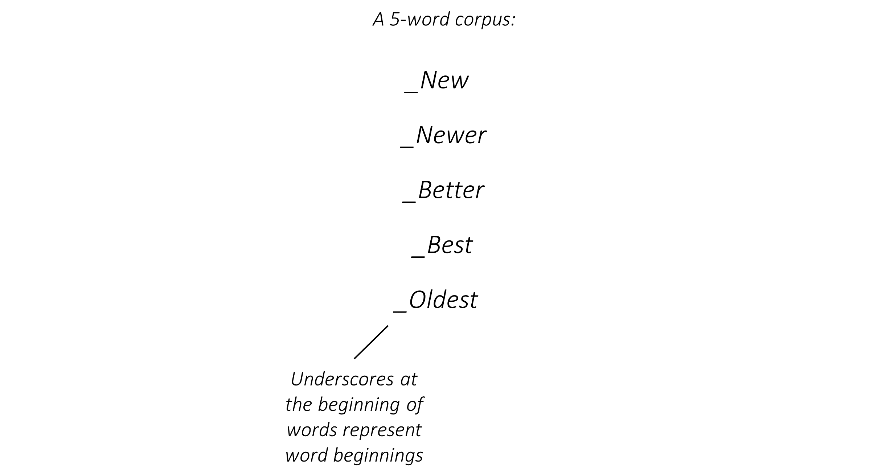
</p>

A small corpus will obviously not reveal the advantages of BPE and subword tokenization – in fact, tokenizing as complete words is probably the best option here – but our goal at the moment is simply to understand the algorithm itself.

Assume that our target vocabulary size $v = 15$.

<p align="center">                            

</p>

<p align="center">                            
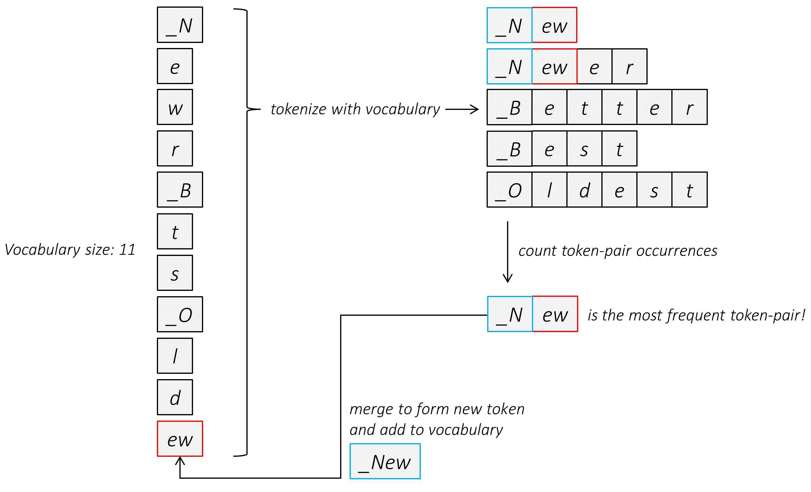
</p>

<p align="center">                            

</p>

<p align="center">                            
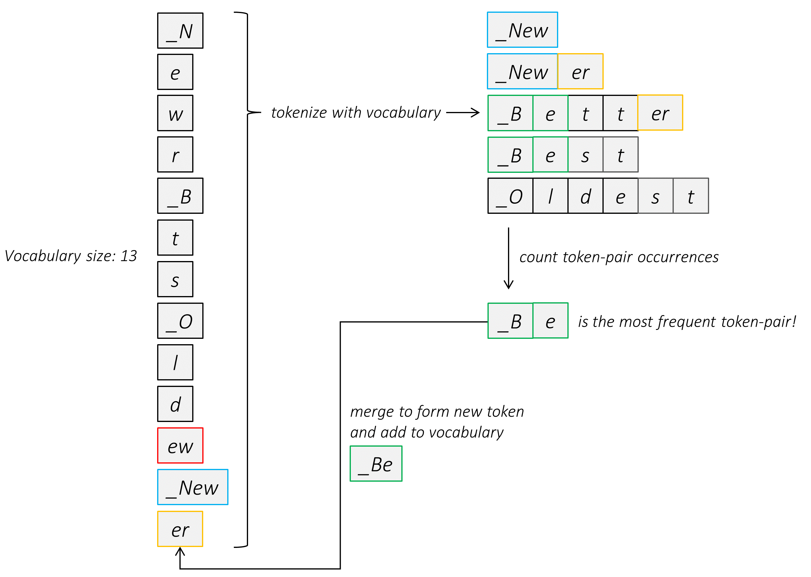
</p>

<p align="center">                            

</p>

<p align="center">                            
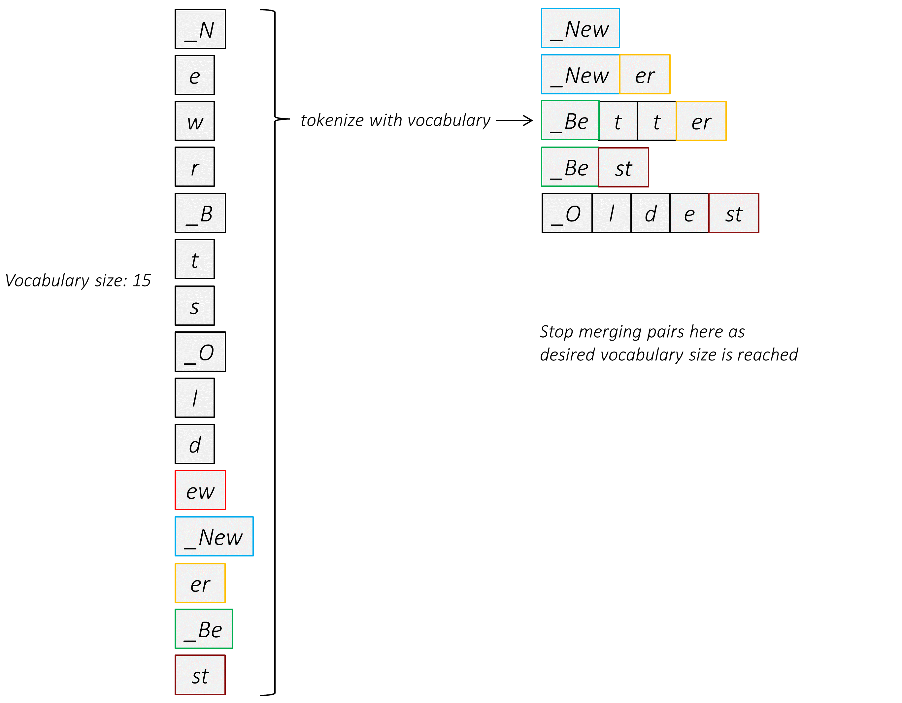
</p>

We have now created a vocabulary! 

**Unseen or new words can be encoded** with this vocabulary.

<p align="center">                            

</p>

In practice, with any *real* training corpus of reasonable size, our vocabulary would be able to encode *any* new word. The only way it could fail is if this new word contains an entirely new character which is improbable.

It's also easy to see why common words will end up directly represented in the vocabulary – because BPE is a frequency-based method. And common subword units, like morphemes or roots, will also be represented, allowing for encoding agglutinated words or compounds. 

**German, especially, is a morphologically rich language** that is famous for its near-endless capacity for compounding. In the [paper](https://arxiv.org/abs/1508.07909) that proposed using BPE for translation, they provide the English sequence "*sewage water treatment plant*" as an example. Its German translation "*Abwasserbehandlungsanlage*" is a single, compound word which may not be represented in our vocabulary (or the training corpus, for that matter). However, the BPE model trained in this tutorial is still able to encode it.

```python
['▁Ab', 'wasser', 'be', 'hand', 'lungs', 'anlage']
```

Similarly, consider the English phrase "*motor vehicle liability insurance*", which would be translated to "*Kraftfahrzeug-Haftpflichtversicherung*".

```python
['▁Kraft', 'fahrzeug', '-H', 'aft', 'pflicht', 'versicherung']
```

As a rather extreme example, consider "*Association for Subordinate Officials of the Main Maintenance Building of the Danube Steam Shipping Electrical Services*" or "[*Donau­dampf­schiffahrts­elektrizitäten­haupt­betriebs­werk­bau­unter­beamten­gesellschaft*](https://en.wikipedia.org/wiki/Donaudampfschiffahrtselektrizit%C3%A4tenhauptbetriebswerkbauunterbeamtengesellschaft)". I'd eat my hat if this overpowered compound is represented in *any* model's vocabulary or training corpus.

```python
['▁D', 'ona', 'ud', 'ampf', 'schif', 'fahrts', 'ele', 'kt', 'r', 'iz', 'itäten', 'haupt', 'bet', 'rie', 'bs', 'werk', 'bau', 'unter', 'beam', 'ten', 'gesellschaft']
```

In a similar vein, **English words are often agglutinated**. Consider, for example, "*antidisestablishmentarianism*" or "*electroencephalographically*".

```python
 ['▁ant', 'id', 'is', 'establish', 'ment', 'arian', 'ism']
```

```python
 ['▁electro', 'ence', 'p', 'hal', 'ograph', 'ically']
```

Note that the BPE model's choice of subword units may not *exactly* correspond to a linguist's choice of morphemes in a word, but that's alright. The vocabulary is decided by the distribution of data in the training corpus, after all, and is far from arbitrary.

### Label-Smoothed Cross-Entropy

The sequence generation task, as you know, is *locally* a classification task. We are predicting "next" tokens using a classification head that computes scores across all tokens in the vocabulary. These scores, via the *Softmax* function, are expressed as a probability or likelihood for each token being the next token in the sequence.

The goal then is to maximize the probability of the true token $w_t$ which we know *should* come next, in a process known as **maximum likelihood estimation**. More conveniently, we choose to maximize its log-likelihood... or alternatively, construct it as *a loss that must be minimized* – the negative of the log-likelihood of $w_t$.

This is the **cross-entropy loss**.

<p align="center">                            

</p>

Alternatively, the cross-entropy loss may be expressed in terms of the likelihoods of *all* tokens in a vocabulary of size $v$ using a one-hot label vector $y$ that is zero-valued at all tokens that are not $w_t$.

<p align="center">                            
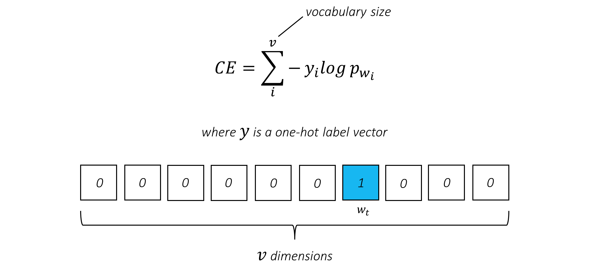
</p>

The one-hot label vector is essentially conditioning the network to produce a score of 100% for $w_t$ and 0% for all others. 

However, often, this can result in a network that's **overconfident and poorly calibrated**. In a properly calibrated model, the confidence with which a model makes predictions would reflect its performance in terms of, say, accuracy. For example, a model that makes its predictions with an average score of 95% but only has an accuracy of 60% is more confident about itself than it has any right to be.

The obvious solution is **regularization**, which as you know usually involves gently sabotaging the model in one way or another. In this case, as we want to penalize very confident predictions, we could simply add some noise to the label vector. Specifically, we *smooth* the label vector so it isn't quite as severe in its landscape as a one-hot vector. This is known as **label-smoothing**. 

<p align="center">                            
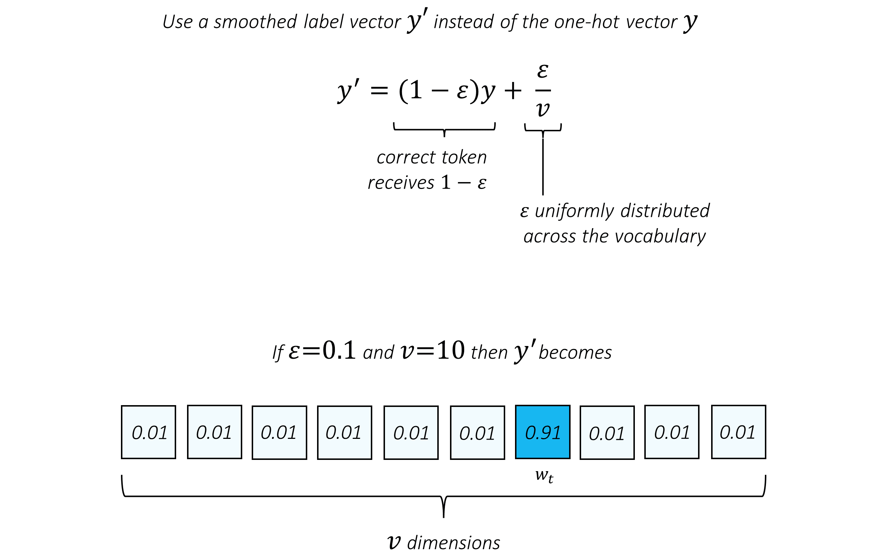
</p>

 The difference between $w_t$ and the other tokens is less stark in the smoothed label vector. The co-efficient $\varepsilon$ determines the strength of the smoothing.

Label-smoothing drives the model to also try to maximize the probabilities of the other tokens, as we would expect with $w_t$, but to a much smaller extent. This is the noise that produces the regularizing effect. 

This modified form of the cross-entopy function is known as **label-smoothed cross-entropy loss**.

<p align="center">                            

</p>

You could also think of this as adding a regularization or noise term to a standard cross-entropy loss that has been scaled by $1-\varepsilon$.

<p align="center">                            
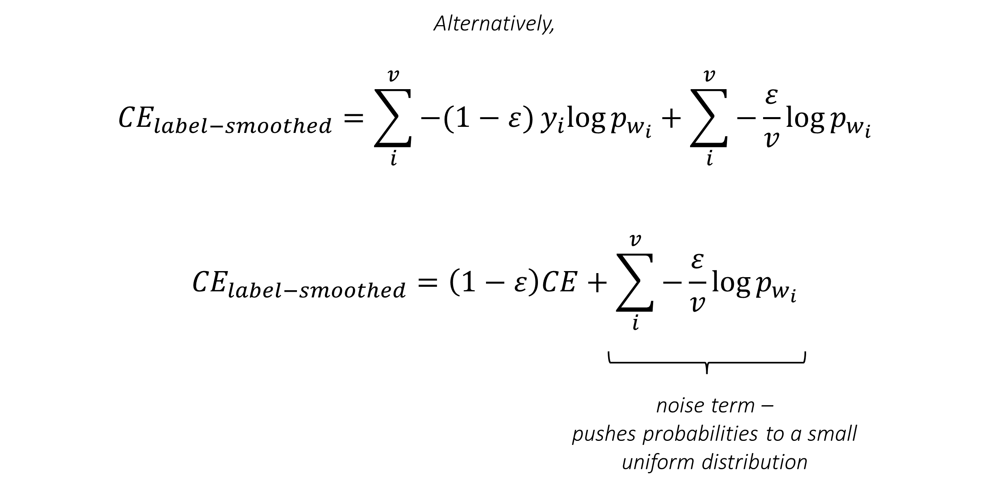
</p>

Since for generation tasks, the vocabulary size $v$ is quite large, each token receives only a miniscule portion of $\varepsilon$ in its redistribution.

### Beam Search

During inference with a trained transformer model, the straightforward – and greedy – option would be to choose the token with the highest score and use it to predict the next token. But this isn't optimal because the rest of the sequence hinges on that first token we choose. If that choice isn't the best, everything that follows is sub-optimal. And it's not just the first token – each token in the generated sequence has consequences for the ones that succeed it.

It might very well happen that if you'd chosen the _third_ best token at that first decoding step, and the _second_ best token at the second step, and so on... _that_ would be the best sequence you could generate.

It would be great if we could somehow _not_ decide until we've finished decoding completely, and then **choose the sequence that has the highest _overall_ score from a basket of candidate sequences**.

**Beam search** does exactly this.

- At the first decode step, use the `<BOS>` token to begin generation, and consider the top $k$ candidates for the first token.
  
- Pass these $k$ first-tokens to the decoder, then calculate the aggregate score (product of probabilities or sum of log-probabilities) for each *first-token-second-token* combination, and then consider the top $k$ combinations from *all* such combinations.
  
- Pass these $k$ candidate sequences to the decoder, calculate the aggregate score for each *first-token-second-token-third-token* combination and choose the top $k$ combinations.
  
- Continue generation by repeating this process.

- Some candidate sequences (subsequences, really) may lead nowhere because generations arising from them do not figure in the top $k$ candidates.
  
- If in the top $k$ candidate sequences, at any step, an `<EOS>` token has been generated, that sequence candidate has reached completion. Set it aside as a completed sequence.

- Stop when at least $k$ sequences have completed generation. Multiple sequences may reach completion at a given time, so it is possible to have more than $k$ completed sequences in the end.

- Choose the completed sequence with the highest aggregate score normalized by length.

The user-defined parameter $k$ is known as the ***beam size***, or ***beam width***, or the ***number of beams***. The greater the value of $k$, the more candidates you will consider at each step during decoding, and greater the computational effort. There are very likely diminishing returns in terms of sequence quality beyond a certain beam size. Note that $k=1$ is the same as greedy search. 

Let's walk through a real example, shall we?

Consider the following English sequence –

> Anyone who retains the ability to recognise beauty will never become old.

This is a quotation from Franz Kafka, *but only a translation* because he originally said it in German –

> Jeder, der sich die Fähigkeit erhält, Schönes zu erkennen, wird nie alt werden. 

I will now present to you this transformer model's attempt at translating this common English translation back to German, as seen during a beam search with $k=4$. I use the following notation –

<p align="center">                            
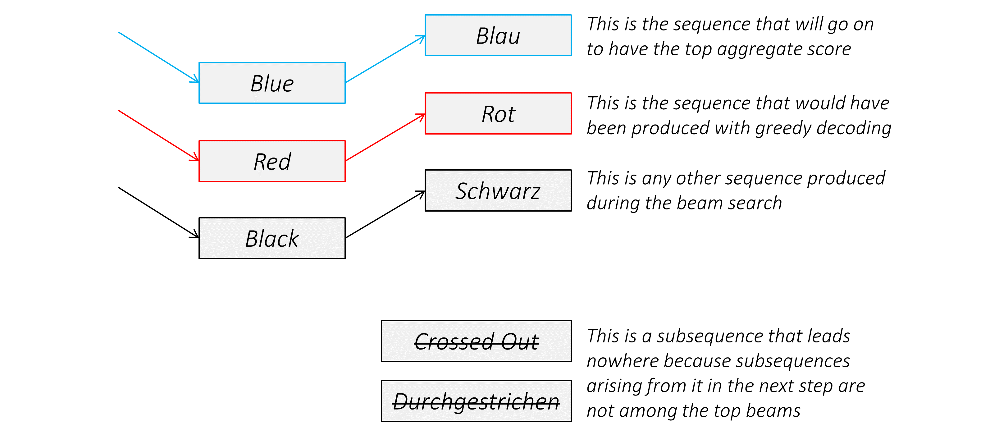
</p>

<br>

Alright, beam me up, Scotty.

<p align="center">                            
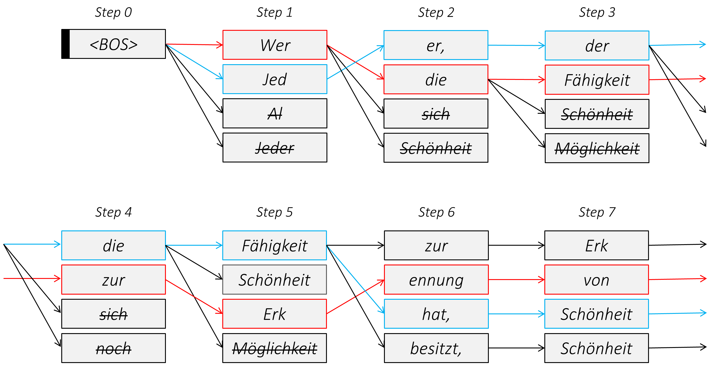
</p>

<br>

<p align="center">                            
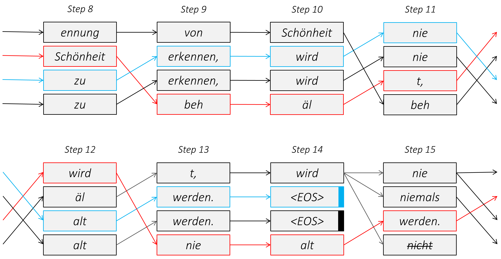
</p>

<br>

<p align="center">                            
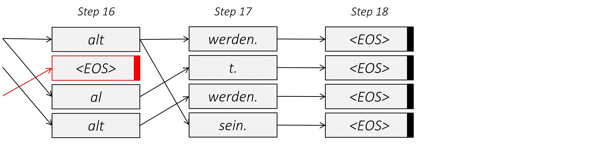
</p>

Because four sequences reach completion together in the last step, we end up with a total of *seven* completed sequences.

<p align="center">                            
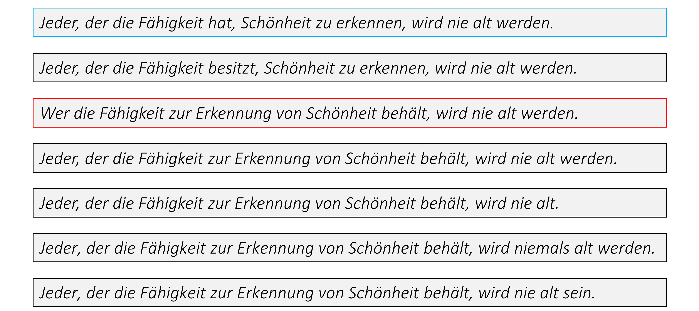
</p>

I do not speak German myself, so I cannot say with any certainty how different these completed sequences are, but it seems that the chosen sequence (in blue) is closer to the original than the sequence that would have been generated *without* beam search (in red).

And with this, it appears that our task of trying to understand the working of the transformer has *also* reached completion. 

# Implementation

The sections below briefly describe the implementation.

They are meant to provide some context, but **details are best understood directly from the code**, which is quite heavily commented.

### Datasets

We will use training, validation, and test data from the [WMT14 English-German translation task](https://www.statmt.org/wmt14/translation-task.html).

#### Description

The **training data** combines three English-German parallel corpora – 

- *Europarl v7*, containing translations from the proceedings of the European Parliament
  
- *Common Crawl*, containing translations from web sources
  
- *News Commentary*, containing translations of news articles

In all, there are 4.5 million English-German sentence pairs.

The **validation data** is the *newstest2013* dataset, which was used as the test data for WMT13, with 3000 English-German sentence pairs.

The **test data** is the *newstest2014* dataset, with 3003 English-German sentence pairs.

#### Download and Prepare Datasets

See [`prepare_data.py`](https://github.com/sgrvinod/a-PyTorch-Tutorial-to-Machine-Translation/blob/master/prepare_data.py).

This executes two functions – 

- See `download_data()` in [`utils.py`](https://github.com/sgrvinod/a-PyTorch-Tutorial-to-Machine-Translation/blob/master/download_data.py).

  While all datasets can be downloaded manually from the [WMT14 homepage](https://www.statmt.org/wmt14/translation-task.html), **you do not need to**. This function automatically downloads them.

  Training datasets are downloaded in their compressed forms from the same sources and extracted. Compressed datasets are downloaded to a folder called `tar files` and files extracted from these are stored in a folder called `extracted files`.

  Validation and test sets are downloaded using the [sacreBLEU](https://github.com/mjpost/sacrebleu) library, which we will also use for computing evaluation metrics – make sure you have it installed. This saves the files `val.en`, `val.de`, `test.en`, and `test.de`. 

- See `prepare_data()` in [`utils.py`](https://github.com/sgrvinod/a-PyTorch-Tutorial-to-Machine-Translation/blob/master/prepare_data.py).

  This combines the contents of all the extracted training datasets into single files `train.en` and `train.de`, amounting to about 4.5 million English-German sentence pairs.

  A Byte Pair Encoding model is then trained from the combined English-German data using the [YouTokenToMe](https://github.com/VKCOM/YouTokenToMe) library and saved to file as `bpe.model`.

  Since I observed some noise in this data (presumably mostly from the Common Crawl dataset), I performed additional filtering of my own – I only kept sentence pairs where, à la our BPE model, the English and German sentences were both between $3$ and $150$ tokens in length, and they didn't differ in their lengths by more than a factor of $2$ (or $\frac{1}{2}$). This resulted in the removal of about $6\%$ of all sentence pairs. You may choose to adjust these parameters or not filter at all – the paper makes no mention of any data cleaning measures.

Therefore, all you need to do is run this file with Python after modifying folder paths as desired –

`python prepare_data.py`

### Model Inputs and Outputs

There are four types of inputs and outputs.

#### Source / Encoder / English Sequences

This is the **source sequence in English that is fed to the encoder** and must ultimately be translated.

As is typical, this will be in the form of indices of the constituent tokens in the vocabulary. This vocabulary was created at the time of training the BPE model.

Since, generally, different sequences in a batch can have different lengths, all sequences are **padded to a fixed length** that is often the length of the longest sequence in the batch. This is done with pad-tokens, which is a special default token in the BPE vocabulary.

The authors of the paper do not use a fixed number of sequences in each batch, but rather a **fixed number of target (German) tokens**. This makes sense because we are ultimately predicting target tokens, and we want each predicted token to have a similar contribution to the loss computed from each batch. This also means that batches with longer or shorter target sequences must have fewer or more sequences respectively. **The number of English or German sequences in a batch will be variable.**

Therefore, **source or encoder or English sequences fed to the model must be a `Long` tensor of dimensions $N \times L_e$**, where $N$ is the number of sequences in the batch, which is variable, and $L_e$ is the padded length of the sequences.

#### Target / Decoder / German Sequences

This is the **target sequence in German that is fed to the Decoder** in a teacher-forcing setting, and is also the **output sequence from the Decoder** in its left-shifted form. Left-shifting the sequence can be done easily during training at the time of computing the loss – we only need the original sequence.

As is also typical, these sequences will be in the form of indices of the constituent tokens in the vocabulary. This vocabulary was created at the time of training the BPE model.

Note that these sequences will need to be prepended with the `<BOS>` ("beginning of sequence") token and appended with the `<EOS>` ("end of sequence") token, which are used to prompt generation of the first word and learn to signal the end of generation respectively. Like pad-tokens, these are also special default tokens in the BPE vocabulary.

As mentioned earlier, the authors of the paper use a fixed number of target (German) tokens per batch. **The number of sequences in a batch will be variable.**

Therefore, **target or decoder or German sequences fed to the model must be a `Long` tensor of dimensions $N \times L_d$**, where $N$ is the number of sequences in the batch, which is variable, and $L_d$ is the padded length of the sequences.

#### Source / Encoder / English Sequence Lengths

Since the source or encoder or English sequences in a batch are padded to a length that does not reflect each sequence's actual length, which is required for preventing attention over the pad tokens, we need to also specify the **actual or true lengths of each sequence in the batch**.

Therefore, **source or encoder or English sequence lengths fed to the model must be a `Long` tensor of dimensions $N$**, where $N$ is the number of sequences in the batch, which is variable.

#### Target / Decoder / German Sequence Lengths

Since the target or decoder or German sequences in a batch are padded to a length that does not reflect each sequence's actual length, which is required for preventing attention and loss computation over the pad tokens, we need to also specify the a**ctual or true lengths of each sequence in the batch**.

Therefore, **target or decoder or German sequence lengths fed to the model must be a `Long` tensor of dimensions $N$**, where $N$ is the number of sequences in the batch, which is variable.

### Custom DataLoader

See `SequenceLoader` in [`dataloader.py`](https://github.com/sgrvinod/a-PyTorch-Tutorial-to-Machine-Translation/blob/master/dataloader.py).

Typically, a PyTorch project will involve the creation of a PyTorch [`Dataset`](https://pytorch.org/docs/master/data.html#torch.utils.data.Dataset), which returns the $i$th datapoint – a *single* datapoint – in the dataset. This is used by a PyTorch [`DataLoader`](https://pytorch.org/docs/master/data.html#torch.utils.data.DataLoader) to create batches of fixed size by stacking as many datapoints from the dataset, randomly or in the same order, into larger tensors. 

However, our **training batches will contain a variable number of sequences** because we instead want a fixed number of target tokens in every batch, at least to the extent possible. This cannot be done in a straightforward manner with a PyTorch dataloader. Further, there is an opportunity to use our own custom logic for how we batch sequences together in a way that will **minimize the number of pad-tokens in a batch**. Remember, while we will make sure to prevent both attention to pad-tokens and their consideration in loss calculations, each layer in the transformer network is *still* operating upon them. For these reasons, we will **use a custom dataloader to create batches** instead of PyTorch's offering.

Our custom dataloader is a standard **python Iterator**, which requires the `__init__()`, `__iter__()`, and `__next__()` methods defined. In addition, we define a `create_batches()` method that contains the logic for creating batches.

In `__init__()`, we load the training, validation, or test data from the files created earlier, and compute their lengths using our trained BPE model. Each resulting datapoint will therefore contain an English and German sequence pair and their lengths. 

If this is a dataloader for training data, we **pre-sort datapoints by the lengths of the German (target) sequences** contained therein. We do not do this for validation or test data because we can simply return batches with single English (source) and German (target) sequence pairs in them and not worry about the number of target tokens. 

In `create_batches()`, if this is a dataloader for training data, we **divide all datapoints into chunks with German (target) sequences of the same length**. We use [`itertools.groupby()`](https://docs.python.org/3/library/itertools.html#itertools.groupby) to accomplish this – hence the pre-sorting we did earlier. 

We **sort the datapoints inside each chunk by their English (source) sequence lengths**. This means that any group of consecutive datapoints in a chunk will contain English sequences of a similar length, minimizing the padding required for packing these sequences into a single tensor. We then **slice the chunk into batches (of datapoints) containing the desired number of German (target) tokens**. In other words, if a particular chunk contains all datapoints with German sequences of length $l$, and we desire each training batch to contain a total of $n$ German tokens, we divide this chunk into batches containing approximately $\frac{n}{l}$ datapoints each. 

By doing this, we have training created batches with about the desired number of German tokens, in a way that will not require any padding for the German sequences and minimal padding for English sequences. 

**All batches from all chunks are then randomly shuffled**, allowing for a different order of batches for each epoch of training. 

In `create_batches()`, if this is a dataloader for validation or test data, we simply create batches with single English (source) and German (target) sequence pairs.

Finally, upon creating batches, we reset a batch counter `current_batch` which keep tracks of how many batches have been returned by the dataloader, which can be used as a condition to stop iteration in the `__next__()` method.

In the `__next__()` method, we are required to return each batch in its final form. Here we **encode the English (source) and German (target) sequences to their indices in the vocabulary** using the trained BPE model. As mentioned earlier, German sequences must be prepended with the `<BOS>` token and appended with the `<EOS>` token. Any padding necessary is done with PyTorch's [`pad_sequence`](https://pytorch.org/docs/stable/generated/torch.nn.utils.rnn.pad_sequence.html#torch.nn.utils.rnn.pad_sequence) helper function. We also **create tensors containing information about the true lengths of the English and German sequences** (i.e., without padding). 

The dataloader, which is a python Iterator, will stop returning batches when a `StopIteration` exception is raised in the `__next__()` method, which is done when all batches have been returned, as tracked by the `current_batch` batch counter. 

For a new epoch of training, the dataloader can be reset by invoking its `create_batches()` method again, which will shuffle batches into a different order and reset the batch counter.

### Multi-Head Attention Layer

See `MultiHeadAttention` in [`model.py`](https://github.com/sgrvinod/a-PyTorch-Tutorial-to-Machine-Translation/blob/master/model.py).

At the time of creation of each instance of this layer, we specify whether it is going to be an attention layer in the decoder with the `in_decoder` parameter. This is because self-attention in the decoder behaves differently from self-attention in the encoder – in the former, each token can only attend to tokens occuring chronologically before it.

During forward propagation, this takes as input $N$ sets of –

- query-sequences, a tensor of $N \times L_{queries} \times d_{model}$ dimensions
  
- key-value sequences, a tensor of $N \times L_{keys} \times d_{model}$ dimensions
  
- true key-value sequence lengths, a tensor of $N$ dimensions

Here, $N$ is the number of query or key-value sequences in the batch, $L_{queries}$ is the maximum padded length of the query sequences, and $L_{keys}$ is the maximum padded length of the key-value sequences. 

We first determine if this will be a case of **self-attention or cross-attention** by checking for equality between the query sequences and key value sequences.

We then store a copy of the query sequences for the purposes of the skip connection. 

We **apply layer normalization** to the query sequences. We also apply layer normalization to the key-value sequences, *unless* this is a case of cross-attention, in which case the key-value sequences will already have been normalized at the end of the encoder. 

We **create $h$ queries** for each token in a query sequence, where $h$ is the number of attention heads. Do we do this with $h$ linear layers? No! This operation can be parallelized with a *single* linear layer that directly projects the tokens in the query sequence from $d_{model}$ dimensions to $h * d_{queries}$ dimensions.

<p align="center">                            
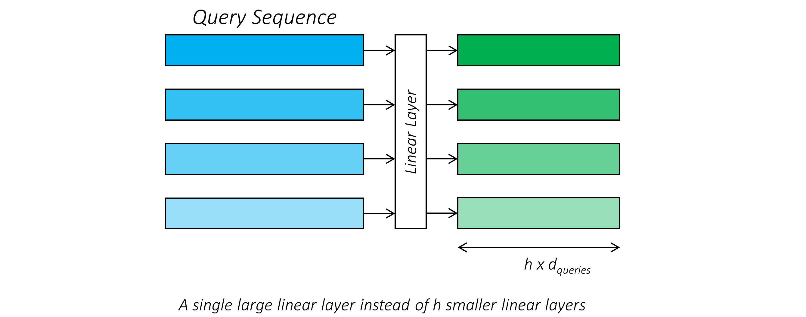
</p>

We can then create $h$ slices from this single output, where each slice is used in a separate attention head.

<p align="center">                            
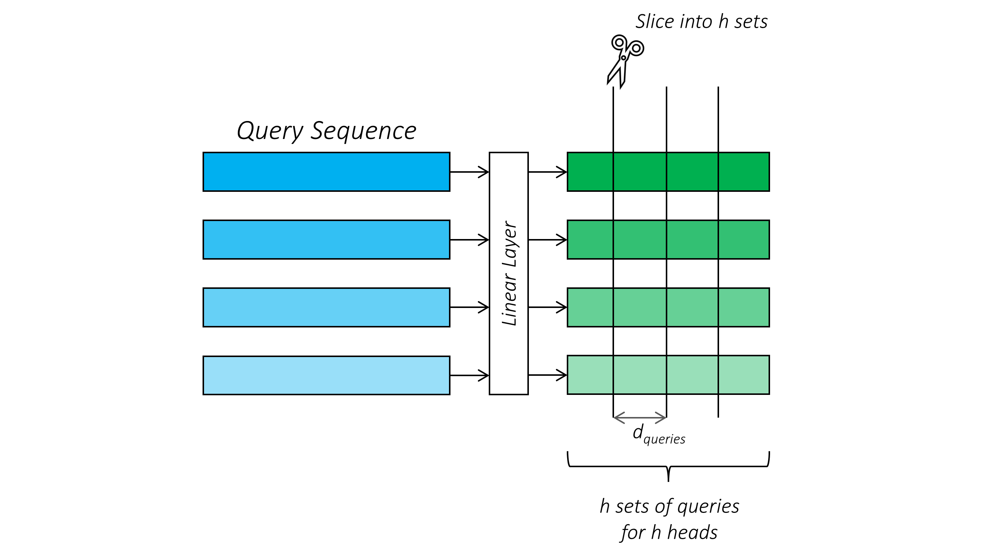
</p>

We do the same to **create the $h$ keys and $h$ values** from the tokens in a key-value sequence. 

In addition, we can create the $h$ sets of keys _and_ $h$ sets of values in one shot with a *single* linear layer by projecting from from $d_{model}$ dimensions to $h * d_{keys} + h * d_{values}$ dimensions.

<p align="center">                            
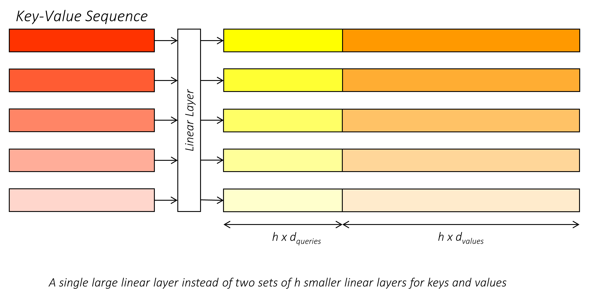
</p>

<p align="center">                            
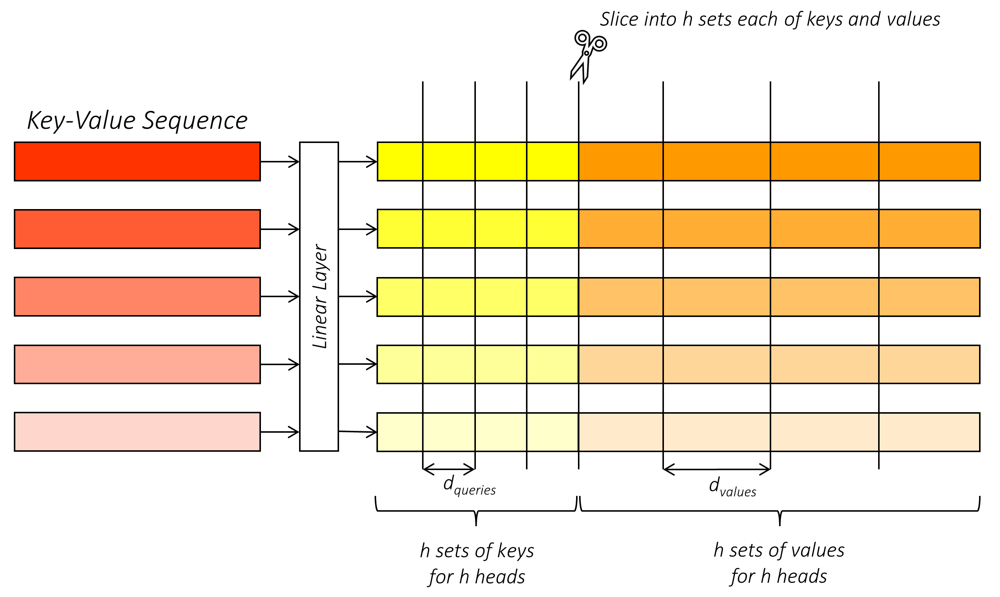
</p>

Since we had $N$ sets of query and key-value sequences, the queries tensor will end up with $N \times L_{queries} \times (h * d_{queries})$ dimensions. 

This can be *rearranged* into the form we need – a 4D tensor of $N \times L_{queries} \times h \times d_{queries}$ dimensions.

<p align="center">                            
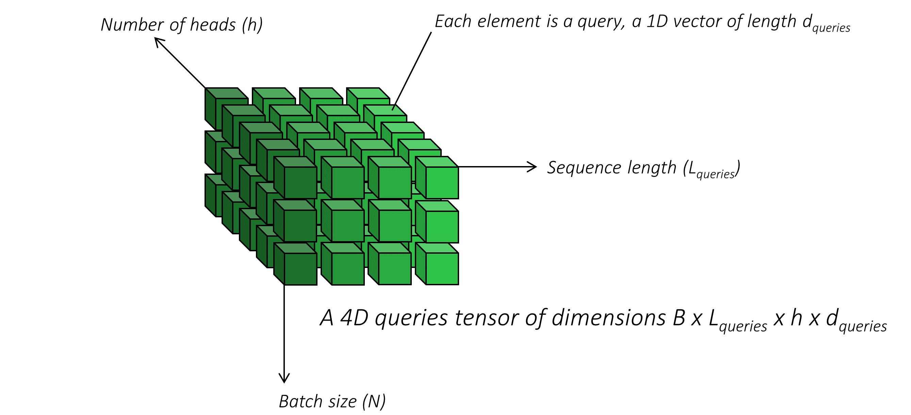
</p>

In a similar vein, keys are rearranged to $N \times L_{keys} \times h \times d_{keys}$ dimensions and values are rearranged to $N \times L_{keys} \times h \times d_{values}$ dimensions.

We also need a way to parallelize the multiple attention heads. We can do this simply by considering the multiple heads as different datapoints in our batch. In other words, we pretend that we have $N * h$ query sequences or key-value sequences with which we perform single-head attention.

This means that the queries will be rearranged to a 3D tensor of $(N * h) \times L_{queries} \times d_{queries}$ dimensions.

<p align="center">                            
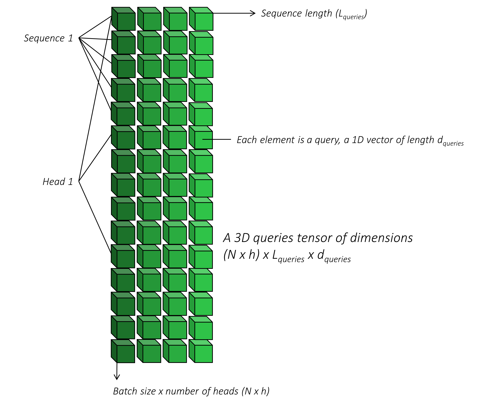
</p>

In a similar vein, keys are rearranged to $(N * h) \times L_{keys} \times d_{keys}$ dimensions and values are rearranged to $(N * h) \times L_{keys} \times d_{values}$ dimensions.

We are now in a position to perform the multi-head attention. We **calculate the dot-products** between the queries and keys. This is accomplished with a *batch matrix multiplication* operation using [`torch.bmm()`](https://pytorch.org/docs/stable/generated/torch.bmm.html#torch-bmm). For each of the $N * h$ datapoints, it computes the dot-products of each of the $L_{queries}$ queries with each of the $L_{keys}$ keys, resulting in a tensor of $(N * h) \times L_{queries} \times L_{keys}$.

The dot-products are scaled by $\sqrt{d_{model}}$.

Before computing the *Softmax*, we need to **mask away invalid attention access** as per the rules described [earlier](https://github.com/sgrvinod/a-PyTorch-Tutorial-to-Machine-Translation#can-anything-attend-to-anything). We introduce up to two masks –

- Mask away keys that are from pad-tokens. This is why we provide the true key-value sequence lengths as an input variable to this layer.
  
- If this is self-attention in the decoder, for each query, mask away keys that are chronologically ahead of queries.

The masking is accomplished by setting the dot-products at these locations to a large negative number $-\infty$, which would evaluate to $0$ under the Softmax, resulting in the values at those locations not being used in the results for those queries.

We then **compute the Softmax** across the $L_{keys}$ dimensions, and **combine the values** in the same proportion as the Softmax weights to obtain the results for all queries, which is in the form of a tensor of $(N * h) \times L_{queries} \times d_{values}$ dimensions.

<p align="center">                            
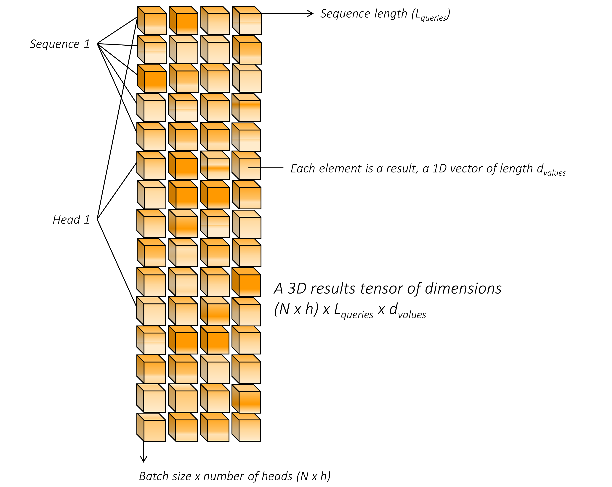
</p>

These results are rearranged into a tensor of $N \times L_{queries} \times h \times d_{values}$ dimensions.

<p align="center">                            
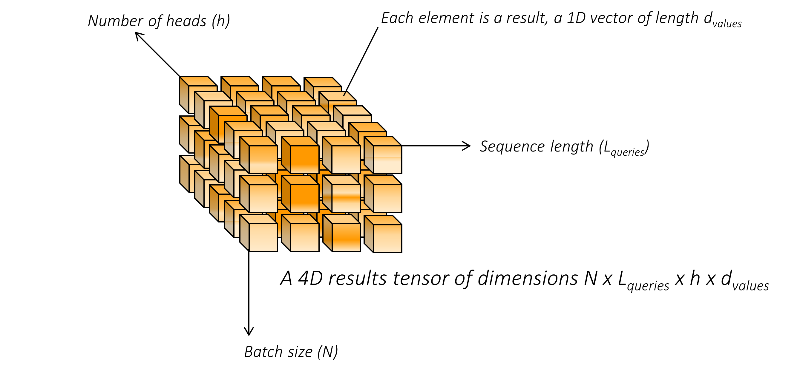
</p>

We then **concatenate results from all $h$ heads** to form a tensor of $N \times L_{queries} \times (h * d_{values})$ dimensions. 

<p align="center">                            
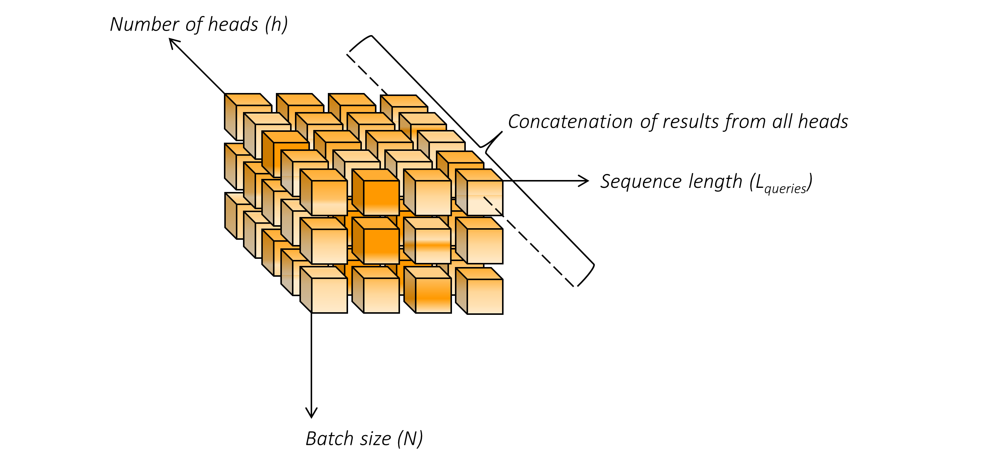
</p>

This is **broadcast to output dimensions $d_{model}$**, resulting in a tensor of $N \times L_{queries} \times d_{model}$ dimensions. 

<p align="center">                            
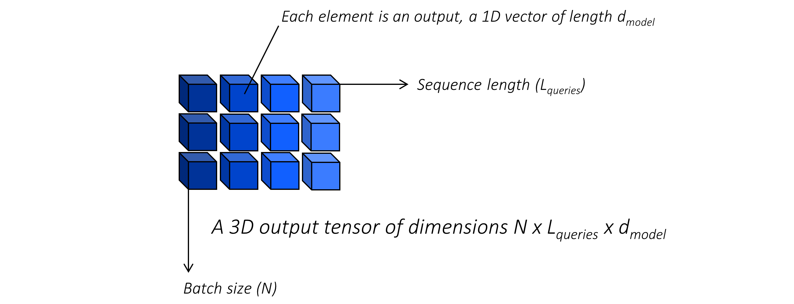
</p>

Multi-head attention is now completed!

Dropout is applied for regularization, and the original query sequences tensor is added point-wise to this tensor to complete the skip-connection. 

### Feed-Forward Layer

See `PositionWiseFCNetwork` in [`model.py`](https://github.com/sgrvinod/a-PyTorch-Tutorial-to-Machine-Translation/blob/master/model.py).

This takes as input a batch of $N$ sequences in the form of a tensor of $N \times L \times d_{model}$ dimensions. 
A copy of this tensor is stored for the purposes of a skip connection.

We **project from $d_{model}$ to $d_{inner}$ dimensions** with a linear layer, resulting in a tensor of $N \times L \times d_{inner}$ dimensions, after which *ReLU* activation and dropout regularization is applied. 
It is **broadcast back to $d_{model}$ dimensions** with a second linear layer, resulting in a tensor of $N \times L \times d_{model}$ dimensions.

Dropout is applied for regularization, and the input tensor is added point-wise to this tensor to complete the skip-connection. 

### Encoder

See `Encoder` in [`model.py`](https://github.com/sgrvinod/a-PyTorch-Tutorial-to-Machine-Translation/blob/master/model.py).

This constructs the **Transformer encoder** [as described](https://github.com/sgrvinod/a-PyTorch-Tutorial-to-Machine-Translation#transformer-encoder). 

The encoder takes as input $N$ sets of –

- encoder (English) sequences, a tensor of $N \times L_e$ dimensions.
  
- true encoder sequence lengths, a tensor of $N$ dimensions

Here, $N$ is the number of encoder sequences in the batch, and $L_e$ is the padded length of the encoder sequences.

For each token, we **combine the token and positional embeddings**. The former is scaled by $\sqrt{d_{model}}$. Dropout is applied. This is now a tensor of $N \times L_e \times d_{model}$ dimensions.

We **pass this through the encoder layers**, each of which combines in series –

- a multi-head *self*-attention sublayer, where the encoder sequences are passed as both the query and key-value sequences

- a feed-forward sublayer 
 
The inputs and outputs of each encoder layer are tensors of $N \times L_e \times d_{model}$ dimensions.

**Apply layer normalization** to the outputs from the final encoder layer. The encoder output is therefore also a tensor of $N \times L_e \times d_{model}$ dimensions.

### Decoder

See `Decoder` in [`model.py`](https://github.com/sgrvinod/a-PyTorch-Tutorial-to-Machine-Translation/blob/master/model.py).

This constructs the **Transformer decoder** [as described](https://github.com/sgrvinod/a-PyTorch-Tutorial-to-Machine-Translation#transformer-decoder). 

The decoder takes as input $N$ sets of –

- decoder (German) sequences, a tensor of $N \times L_d$ dimensions
  
- true decoder sequence lengths, a tensor of $N$ dimensions

- encoded (English) sequences from the encoder, a tensor of $N \times L_e$ dimensions
  
- true encoder sequence lengths, a tensor of $N$ dimensions

Here, $N$ is the number of decoder sequences in the batch, $L_d$ is the padded length of the decoder sequences, and $L_e$ is the padded length of the (encoded) encoder sequences.

For each token in the decoder sequence, we **combine the token and positional embeddings**. The former is scaled by $\sqrt{d_{model}}$. Dropout is applied. This is now a tensor of $N \times L_d \times d_{model}$ dimensions.

We **pass this through the decoder layers**, each of which combines in series –

- a multi-head *self*-attention sublayer, where the decoder sequences are passed as both the query and key-value sequences

- a multi-head *cross*-attention sublayer, where the decoder sequences is passed as the query sequences and the encoded sequences from the encoder are passed as key-value sequences
  
- a feed-forward sublayer in series. The inputs and outputs of each encoder layer are tensors of $N \times L_d \times d_{model}$ dimensions.

We **apply layer normalization** to the outputs from the final decoder layer. 

Finally, we **apply the classification head**, which is a linear layer that calculates scores (logits) over the vocabulary for predicting the next token. This is a tensor of $N \times L_d \times v$ dimensions, where $v$ is the size of the vocabulary. 

We do not apply the *Softmax* function here because this is done in the loss function.

### Transformer

See `Transformer` in [`model.py`](https://github.com/sgrvinod/a-PyTorch-Tutorial-to-Machine-Translation/blob/master/model.py).

This constructs the **Transformer** by combinging the encoder and decoder [as described](https://github.com/sgrvinod/a-PyTorch-Tutorial-to-Machine-Translation#putting-it-all-together). 

All parameters other than the token embeddings are initialized with [Glorot or Xavier uniform initialization](https://pytorch.org/docs/stable/nn.init.html#torch.nn.init.xavier_uniform_). Token embeddings are initialized from a [normal distribution](https://pytorch.org/docs/stable/nn.init.html#torch.nn.init.normal_). 

As explained, we tie the parameters of the token embedding layer in the encoder, the token embedding layer in the decoder, and the classification head in the decoder.

### Label-Smoothed Cross Entropy

See `LabelSmoothedCE` in [`model.py`](https://github.com/sgrvinod/a-PyTorch-Tutorial-to-Machine-Translation/blob/master/model.py).

This takes as input $N$ sets of –

- predicted token scores (logits) from the classification head, a tensor of $N \times L_d \times v$ dimensions.

- the target gold tokens, a tensor of dimensions $N \times L_d$

Here, $N$ is the number of English-German sequence pairs in the batch, $L_d$ is the padded length of the decoder sequences, and $v$ is the vocabulary size.

As you know, scores and targets at pad-tokens are meaningless and should not be considered in the loss calculation. We **remove all pad-tokens** using [`pack_padded_sequence()`](https://pytorch.org/docs/stable/generated/torch.nn.utils.rnn.pack_padded_sequence.html#torch-nn-utils-rnn-pack-padded-sequence). 

For a helpful visualization of how this function operates, see [this section](https://github.com/sgrvinod/a-PyTorch-Tutorial-to-Image-Captioning#loss-function) from my previous tutorial. Basically, if you have sequences sorted by decreasing true lengths in a tensor of dimensions $N \times L \times d$, where $L$ is the padded length, `pack_padded_sequence()` flattens it by concatenating only the non-pad tokens from each timestep. Therefore, this flattened tensor of only non-pad tokens has dimensions $k \times d$, where $k$ is the sum of the true lengths $l$ of the sequences, $k=\sum_{i=0}^{N} l_i$.

(This is not important, but if you're interested – `pack_padded_sequence()` was designed for use with RNNs, for dynamic batching across timesteps as a way to avoid processing pad-tokens. It keeps track of the effective batch size $N_t$ at each timestep $t$ in the sorted sequence so that the RNN cell can operate only upon the top $N_t$ (i.e. non-pad) tokens at each timestep, and the outputs will already be aligned for use with the $N_{t+1}$ non-pad tokens in the next timestep. In this case, however, we are only interested in its utility as a convenient method for removing pad-tokens!)

Therefore, after removing pad-tokens, the scores are in a tensor of $k \times v$ dimensions, and the targets are in a tensor of $k$ dimensions. 

We **create one-hot label vectors** using [`scatter()`](https://pytorch.org/docs/stable/generated/torch.scatter.html#torch-scatter). From these, we **create smoothed label vectors** by assigning $1-\varepsilon$ to the target token index and distributing $\varepsilon$ uniformly across all tokens. 

We **calculate the label-smoothed cross entropy loss** from these smoothed label vectors and the [`log_softmax()`](https://pytorch.org/docs/stable/generated/torch.nn.functional.log_softmax.html#torch-nn-functional-log-softmax) of the scores.

# Training

See [`prepare_data.py`](https://github.com/sgrvinod/a-PyTorch-Tutorial-to-Machine-Translation/blob/master/prepare_data.py).

Before you begin, make sure to **download and prepare the required data** for training, validation, and evaluation. To do this, run the contents of this file after pointing it to the folder where you want data to be downloaded, extracted, and prepared –

```
python prepare_data.py
```

See [`train.py`](https://github.com/sgrvinod/a-PyTorch-Tutorial-to-Machine-Translation/blob/master/train.py).

The parameters for the model (and training it) are at the beginning of the file, so you can easily check or modify them should you need to.

To **train your model from scratch**, run this file –

```
python train.py
```

Checkpoints are saved at the end of every epoch of training with the name `transormer_checkpoint.pth.tar`, with each new checkpoint overwriting the previous one. To **resume training at a checkpoint**, point to the corresponding file with the `checkpoint` parameter at the beginning of the code.

See [`average_checkpoints.py`](https://github.com/sgrvinod/a-PyTorch-Tutorial-to-Machine-Translation/blob/master/average_checkpoints.py).

Checkpoints are also saved as separate files every $1500$ steps in the final two epochs only, with the name `step[N]_transformer_checkpoint_pth.tar`, where `[N]` is the step number. These checkpoints should be averaged to produce the final transformer checkpoint that will be used in evaluation and inference. To **average all such checkpoints** after training, run this file –

```
python average_checkpoints.py
```

The final, averaged checkpoint will be named `averaged_transformer_checkpoint.pth.tar`. 

### Remarks

I (mostly) used the hyperparameters recommended in the paper for the "base" transformer model. 

The Byte Pair Encoding model was trained for a shared English-German vocabulary size $v = 37000$. 

I trained for $10^5$ steps with a batch size of approximately $25000$ target (German) tokens. The *Adam* optimizer was used, with a variable learning rate schedule, where the learning rate $lr$ was increased linearly over $4000$ warmup steps, and then decreased proportionally to the inverse square root of the step number $s$, using the formula $lr = d_{model}^{-0.5} * \min(s^{-0.5}, s * 4000^{-1.5})$. 

A label-smoothed cross-entropy was used as the loss function, with a smoothing coefficient $\varepsilon = 0.1$.

I trained with a single RTX 2080Ti GPU. Since I couldn't fit an entire batch of $25000$ target (German) tokens into memory at once, I used batches of size $2000$ target tokens with gradients accumulated over $12$ batches before performing gradient descent. You can adjust these figures to match your memory constraints.

The authors of the paper averaged the last $5$ checkpoints "which were written at $10$-minute intervals" to produce a final model checkpoint to be used for evaluation and inference. I instead averaged checkpoints saved every $1500$ steps in the last $2$ epochs. 

### Model Checkpoint

My trained (and averaged) transformer checkpoint, along with the trained BPE model, is available [here](https://drive.google.com/drive/folders/18ltkGJ2P_cV-0AyMrbojN0Ig4JgYp9al?usp=sharing).

Note that this checkpoint should be [loaded directly with PyTorch](https://pytorch.org/docs/stable/generated/torch.load.html#torch.load) for inference or evaluation – see below.

# Inference

See [`translate.py`](https://github.com/sgrvinod/a-PyTorch-Tutorial-to-Machine-Translation/blob/master/translate.py).

Make sure to point to both the BPE model and trained checkpoint at the beginning of the file. 

Run the `translate()` function on any source English sequence with your desired beam size (defaults to $4$) and length normalization coefficient (defaults to $0.6$). This function **performs beam search** and outputs the best hypothesis for the translated German sequence, as well as all hypotheses completed during the beam search and their scores.

# Evaluation

Make sure to point to both the BPE model and the trained checkpoint at the beginning of [`translate.py`](https://github.com/sgrvinod/a-PyTorch-Tutorial-to-Machine-Translation/blob/master/translate.py), since the `translate()` function from this file is used to perform the evaluation in [`eval.py`](https://github.com/sgrvinod/a-PyTorch-Tutorial-to-Machine-Translation/blob/master/eval.py). 

See [`eval.py`](https://github.com/sgrvinod/a-PyTorch-Tutorial-to-Machine-Translation/blob/master/eval.py).

To **evaluate the chosen model checkpoint**, run this file –

```
python eval.py
```

As in the paper, we should use a beam size of $4$ and a length normalization coefficient of $0.6$ for the beam search. 

This script calculates BLEU scores for a number of different casing and tokenization scenarios, each of which can be represented with a [sacreBLEU signature](https://github.com/mjpost/sacrebleu#version-signatures) that makes it easy to describe the exact method used in the BLEU calculation – something research papers generally [*should* but *don't* do](https://github.com/mjpost/sacrebleu#motivation) when reporting results.

Here's how my trained model fares against the test set –

|   BLEU   | Tokenization  | Cased |                                   sacreBLEU signature                                    |
| :------: | :-----------: | :---: | :--------------------------------------------------------------------------------------: |
| **25.1** |      13a      |  Yes  | `BLEU+case.mixed+lang.en-de+numrefs.1+smooth.exp+test.wmt14/full+tok.13a+version.1.4.3`  |
| **25.6** |      13a      |  No   |   `BLEU+case.lc+lang.en-de+numrefs.1+smooth.exp+test.wmt14/full+tok.13a+version.1.4.3`   |
| **25.9** | International |  Yes  | `BLEU+case.mixed+lang.en-de+numrefs.1+smooth.exp+test.wmt14/full+tok.intl+version.1.4.3` |
| **26.3** | International |  No   |  `BLEU+case.lc+lang.en-de+numrefs.1+smooth.exp+test.wmt14/full+tok.intl+version.1.4.3`   |

The first value (13a tokenization, cased) is how the BLEU score is officially calculated by [WMT](https://www.statmt.org/wmt14/translation-task.html) (using `mteval-v13a.pl`).

The BLEU score reported in the paper is **27.3**. This is possibly not calculated in the same manner, however. See [these](https://github.com/tensorflow/tensor2tensor/issues/317#issuecomment-377580270) [comments](https://github.com/tensorflow/tensor2tensor/issues/317#issuecomment-380970191) on the official repository. With the method stated there (i.e. using `get_ende_bleu.sh` and a tweaked reference), my trained model scores **26.49**.

# Frequently Asked Questions

I will populate this section over time from common questions asked in the [*Issues*](https://github.com/sgrvinod/a-PyTorch-Tutorial-to-Machine-Translation/issues) section of this repository.

**Some details in your implementation are either different from the paper or not included in the paper. What's up with that?**

In some places, I have mentioned clearly why I do something differently from the paper. In others, I am doing something differently because the [official implementation](https://github.com/tensorflow/tensor2tensor) of this paper does it differently. This may be because improvements were made after the paper was published. Also, a few details that you can find in that official repository are simply not mentioned in the paper.

While writing my implementation, I referred to [this article](https://tunz.kr/post/4) which summarizes these differences and omissions from the paper, although I didn't incorporate all such changes. 

Notably, in this implementation, we use the following ideas from the official implementation –

- Layer normalization is applied to the input of the sublayer as and not after the skip connection at the output of the sublayer as in the paper.

- Dropout is also applied after the *Softmax* operation in the attention mechanism and the *ReLU* activation in the position-wise feed-forward layer – this isn't mentioned in the paper.

- We use Xavier/Glorot initialization with a gain of $1$ for encoder and decoder layers and normal initialization with a mean of $0$ and a standard deviation of $d_{model}^{-0.5}$ for embedding layers – this isn't mentioned in the paper either.

- The learning rate curve from the paper is doubled in magnitude. Also, learning rate is warmed up over $8000$ steps, instead of the $4000$ steps mentioned in the paper.